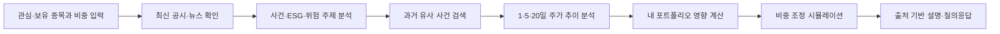
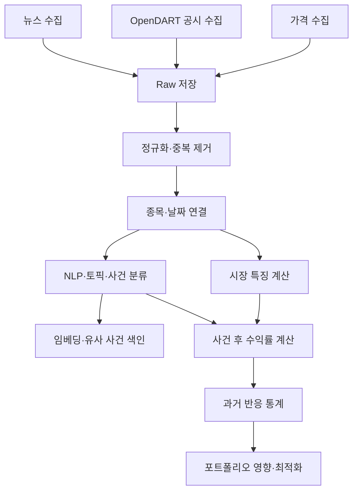

# StockEcho 제품 요구사항 문서(PRD)

> 이 문서는 StockEcho 프로젝트의 기준 문서이자 AI 컨텍스트 복원용 문서다.  
> 새 대화에서 이 문서를 먼저 제공하면 현재까지의 기획 의도, 확정 사항, 기술 방향과 미확정 사항을 빠르게 복원할 수 있다.

| 항목 | 내용 |
|---|---|
| 제품명 | StockEcho |
| 프로젝트 | SeSAC 미니 프로젝트 2 - 데이터 기반 지능형 투자 |
| 문서 버전 | v1.0 Draft |
| 작성 기준일 | 2026-07-20 |
| 문서 상태 | 팀 논의 및 MVP 개발 기준 |
| 서비스 유형 | 관심 종목·포트폴리오 기반 공시·뉴스 및 과거 시장 반응 분석 서비스 |

---

## 0. AI 컨텍스트 복원 요약

StockEcho는 사용자가 관심 있거나 보유한 종목과 비중을 입력하면 최신 공시·뉴스를 한눈에 보여주고, 현재 사건과 유사한 과거 사건을 찾아 당시 1일·5일·20일 주가 추이를 분석한다. 과거 반응을 현재 보유 비중에 적용해 포트폴리오 영향 시나리오를 제공하고, 위험을 낮춘 비중 조정안을 비교한다. RAG는 계산하지 않고 실제 공시·뉴스를 근거로 분석 결과를 설명한다.

핵심은 단순 뉴스 모음이나 주가 예측이 아니라 다음 연결이다.

```text
오늘의 공시·뉴스
→ 어떤 사건인지 분석
→ 과거 비슷한 사건 검색
→ 당시 주가 반응 확인
→ 내 포트폴리오 영향 시뮬레이션
→ 비중 조정안과 근거 확인
```

프로젝트는 네 파트로 나눈다.

1. 기획
2. UX/UI 디자인
3. 데이터·모델링
4. 서비스 개발·통합

현재 사용자는 데이터·모델링 파트를 담당한다.

---

## 1. 제품 정의

### 1.1 한 문장 정의

> 관심 종목의 공시·뉴스를 분석하고, 과거 유사 사건의 주가 추이와 내 포트폴리오 영향을 보여주는 투자 위험 분석 서비스

### 1.2 Elevator Pitch

개인 투자자는 관심 기업에 관한 공시와 뉴스를 여러 사이트에서 찾아야 하고, 해당 사건이 실제 주가에 어떤 영향을 줄 수 있는지 판단하기 어렵다. StockEcho는 현재 기업 사건과 유사한 과거 사례를 찾아 실제 시장 반응을 보여주고, 사용자의 현재 비중을 반영한 영향 시나리오와 위험 조정안을 제공한다.

### 1.3 핵심 사용자 질문

- 오늘 내가 관심 있는 기업에 무슨 일이 있었는가?
- 이 사건은 위험, 기회, 중립 중 어디에 가까운가?
- 과거에 비슷한 사건이 있었는가?
- 당시 주가는 1일·5일·20일 동안 어떻게 움직였는가?
- 같은 반응이 나타난다고 가정하면 내 포트폴리오 영향은 어느 정도인가?
- 위험을 줄이려면 비중을 어떻게 조정할 수 있는가?
- 이 판단을 뒷받침하는 원문 공시·뉴스는 무엇인가?

### 1.4 핵심 가치

StockEcho는 “위험하다”는 점수만 제시하지 않는다. 현재 사건, 과거 유사 사례, 실제 주가 반응, 개인 포트폴리오 영향을 하나의 흐름으로 연결한다.

---

## 2. 문제 정의와 제품 원칙

### 2.1 해결하려는 문제

- 공시·뉴스·가격 정보가 서로 분리되어 있다.
- 초보 투자자는 공시와 금융 용어를 이해하기 어렵다.
- 뉴스가 내 보유 비중에 어떤 영향을 줄 수 있는지 계산하기 어렵다.
- 단순 생성형 AI는 출처 없는 설명이나 잘못된 수치를 만들 수 있다.
- 단일 위험점수만으로는 사용자가 판단 근거를 검증하기 어렵다.

### 2.2 제품 원칙

1. **계산과 설명을 분리한다.** 수치는 Python 분석 엔진이 계산하고 LLM은 설명만 담당한다.
2. **모든 핵심 주장에 근거를 연결한다.** 공시·뉴스 제목, 발행일, 원문 링크를 제공한다.
3. **미래 수익률을 확정적으로 예측하지 않는다.** 과거 사례 기반 시나리오와 하락 위험으로 표현한다.
4. **현재와 과거를 연결한다.** 현재 문서만 요약하지 않고 유사 사건 이후의 실제 시장 반응을 보여준다.
5. **개인 비중을 반영한다.** 종목 단위 분석을 포트폴리오 영향으로 연결한다.
6. **데이터 기준시각과 한계를 표시한다.** 표본 부족, 오래된 데이터, 낮은 유사도는 명시한다.
7. **E2E 데모를 우선한다.** 기능 수보다 한 번에 끝까지 작동하는 흐름을 먼저 완성한다.

### 2.3 비목표

- 실제 투자자문, 매수·매도 지시 또는 자동매매
- 확정 수익률, 목표가 또는 수익 보장
- 증권계좌 연결
- 초 단위 실시간 시세
- 한국 상장 종목 전체 지원
- LLM이 위험점수나 추천 비중을 직접 생성하는 구조
- 뉴스 본문의 무제한 저장·재배포

---

## 3. 목표 사용자

### 3.1 주요 사용자

공시와 뉴스는 확인하지만 전문 용어와 시장 영향을 해석하기 어려운 개인 투자자다. KOSPI 대형주 2~5개를 관심 종목 또는 보유 종목으로 관리하며, 수익 극대화보다 현재 위험을 빠르게 이해하고 싶어 한다.

### 3.2 보조 사용자

환경·사회·지배구조 이슈가 보유 기업에 미치는 영향을 근거 문서와 함께 확인하고 싶은 ESG 관심 투자자다.

---

## 4. MVP 범위

### 4.1 종목과 입력

- 데이터 품질을 검증한 KOSPI 대형주 10개 내외
- 사용자는 최소 2개, 최대 5개 종목 선택
- 종목별 현재 비중 입력
- 비중 합계 100%
- 투자 성향: 안정형·균형형·적극형
- 공매도 및 음수 비중 미지원

### 4.2 데이터 범위

| 데이터 | MVP 범위 | 목적 |
|---|---|---|
| 가격 | 최근 2년 이상 일봉 | 시장 특징, 사건 수익률, 포트폴리오 위험 |
| 공시 | OpenDART에서 확보 가능한 기간 | 기업 사건 탐지와 근거 |
| 뉴스 | API가 안정적으로 제공하는 기간 | 사건 탐지, 토픽 분류, 유사 사건 검색 |
| 시장지수 | KOSPI 등 벤치마크 일봉 | 비정상수익률 계산 |

### 4.3 MVP 핵심 기능

- 관심·보유 종목과 비중 입력
- 최신 공시·뉴스 통합 피드
- 문서별 E/S/G 및 위험·기회·중립 분류
- 주요 사건 토픽과 위험 키워드 표시
- 과거 유사 사건 검색
- 사건 후 1일·5일·20일 주가 반응 분석
- 단순수익률과 시장 대비 비정상수익률 구분
- 현재 비중을 반영한 포트폴리오 영향 시나리오
- 현재 비중과 위험 조정 비중 비교
- 실제 문서 출처가 연결된 RAG 설명

---

## 5. 핵심 사용자 흐름



### 5.1 상세 흐름

1. 사용자가 관심 또는 보유 종목을 선택한다.
2. 보유 비중과 투자 성향을 입력한다.
3. 서비스가 선택 종목의 최신 공시·뉴스를 보여준다.
4. 문서를 E/S/G, 위험·기회·중립, 사건 토픽으로 분류한다.
5. 현재 사건과 같은 토픽에 속하는 과거 문서를 검색한다.
6. 유사 사건의 1일·5일·20일 수익률과 비정상수익률을 계산한다.
7. 평균, 중앙값, 하락 비율, 최악·최선 사례와 표본 수를 표시한다.
8. 과거 반응을 현재 보유 비중에 적용한 단순 영향 시나리오를 계산한다.
9. 위험 모델과 최적화 엔진이 현재 비중과 제안 비중을 비교한다.
10. RAG가 계산 결과를 실제 공시·뉴스 근거와 함께 설명한다.

### 5.2 사용자에게 보여주는 정보 순서

```text
현재 무슨 일이 있었는가
→ 과거 비슷한 일이 있었는가
→ 당시 주가는 어떻게 움직였는가
→ 내 포트폴리오에는 어떤 영향이 가능한가
→ 비중을 조정하면 위험이 얼마나 달라지는가
→ 어떤 문서가 근거인가
```

---

## 6. 기능 요구사항

### FR-01. 종목·포트폴리오 입력

- 관심 종목 또는 보유 종목 선택
- 현재 비중 입력 및 합계 검증
- 안정형·균형형·적극형 선택
- 중복 종목, 음수 비중, 최대 종목 수 검증

### FR-02. 오늘의 공시·뉴스

- 선택 종목에 해당하는 최신 공시·뉴스 통합 표시
- 제목, 출처 유형, 발행일, 요약, 원문 링크 제공
- E/S/G 분류와 사건 방향 표시
- 데이터 수집 기준시각 표시

### FR-03. 사건 분석

- 위험 키워드와 대표 토픽 표시
- 사건 방향을 `risk`, `opportunity`, `neutral`로 구분
- 같은 URL·제목·내용의 중복 문서 제거
- BERTopic 잡음 토픽은 낮은 신뢰도로 표시하거나 제외

### FR-04. 과거 유사 사건 및 주가 추이

- 같은 토픽 내 의미적으로 유사한 과거 사건 Top-K 검색
- 1일·5일·20일 수익률과 시장 대비 비정상수익률 계산
- 평균, 중앙값, 하락 비율, 표본 수 제공
- 가능하면 최악·최선 사례와 회복 기간 제공
- 결과에 사용한 사건과 원문을 다시 확인할 수 있어야 함
- 표본이 적거나 유사도가 낮으면 확정적 표현 금지

### FR-05. 포트폴리오 영향 시나리오

기본 계산은 다음과 같다.

```text
단순 영향 = 현재 종목 비중 × 과거 유사 사건의 대표 수익률
포트폴리오 영향 = 종목별 단순 영향의 합
```

이 결과는 미래 예측값이 아니라 과거 사례를 현재 비중에 적용한 시나리오임을 명시한다.

### FR-06. 하락 위험

- 종목별 향후 5거래일 하락 위험 확률 제공
- 시장·가격·거래량·텍스트 특징을 사용
- 위험 확률, 과거 사건 반응, 분석 신뢰도를 서로 다른 지표로 표시
- 단순 모델을 기준선으로 두고 복잡한 모델의 개선 여부를 검증

### FR-07. 비중 조정 시뮬레이션

- 현재 비중과 제안 비중 비교
- 현재·제안 포트폴리오 위험 비교
- 종목별 최대 비중과 공매도 금지 적용
- 지나친 비중 변경을 제한
- 최적화 실패 시 현재 비중 또는 동일가중안을 fallback으로 제공

### FR-08. 근거 기반 설명

- 사용자가 “왜 위험한가?”, “과거 비슷한 사건에서는 어땠나?”를 질문할 수 있음
- 현재 분석 종목과 기준시점 내 문서만 검색
- 답변의 핵심 주장에 source ID, 제목, 날짜, 링크 연결
- LLM은 모델 수치와 추천 비중을 변경하지 않음
- 근거 부족 시 부족하다고 응답

---

## 7. 데이터·모델링 설계

### 7.1 분석 단위

```text
종목 × 사건 발생일
```

한 사건에는 종목, 사건일, 관련 문서, 토픽, E/S/G, 사건 방향, 1일·5일·20일 수익률, 비정상수익률, 회복 기간을 연결한다.

### 7.2 데이터 파이프라인



### 7.3 기술별 역할

| 기술 | 역할 | MVP 위치 |
|---|---|---|
| pandas·NumPy | 가격·문서 정제, 수익률 계산 | 필수 |
| Kiwi | 한국어 형태소 분석 | 권장 |
| TF-IDF | 위험 키워드와 유사도 기준선 | 필수 기준선 |
| SentenceTransformer | 문서 임베딩 | 필수 |
| BERTopic | 사건 주제 군집화 | 핵심 |
| Logistic Regression | 하락 분류 기준선 | 필수 기준선 |
| MLP | 향후 5일 하락 위험 분류 | 실험 후 채택 |
| LSTM | 위험/일반 문장 분류 비교 | P1 또는 수업 시연 |
| Event Study | 사건 후 시장 반응·비정상수익률 | 핵심 |
| CVaR | 큰 손실 중심 포트폴리오 위험 | 최적화 후보 |
| RAG·LLM | 출처 기반 결과 설명 | 핵심 설명 계층 |

### 7.4 사건연구

MacKinlay(1997)의 Event Study 방법을 이론 근거로 사용한다.

- 사건일 정의
- 장 마감 이후 문서의 다음 거래일 처리
- 거래일 기준 1일·5일·20일 창 설정
- 종목 단순수익률과 시장 대비 비정상수익률 구분
- 미래 문서·수익률이 입력 특징에 들어가지 않도록 기준시점 고정

### 7.5 하락 위험 모델

기본 라벨 후보:

```python
future_return_5d = close[t + 5] / close[t] - 1
downside_label_5d = 1 if future_return_5d <= -0.03 else 0
```

입력 후보:

- 최근 1일·5일·20일 수익률
- 5일·20일 변동성
- 거래량 비율
- 최대 낙폭
- 시장수익률
- 최근 뉴스 수
- 텍스트 위험점수
- E/S/G 위험점수
- 유사 사건의 과거 하락 비율

시간순으로 train·validation·test를 분할하며 Accuracy 단독이 아니라 Recall, Precision, F1, PR-AUC를 사용한다.

### 7.6 텍스트 분석

P0 기준선:

```text
위험 사전
+ TF-IDF 위험 키워드
+ 최근 위험 문서 빈도
```

BERTopic은 사건 종류를 묶는 모델이며 위험·호재 방향을 직접 판정하는 모델로 사용하지 않는다. 방향 분류는 규칙, 지도학습 모델 또는 검증 가능한 구조화 분류 단계로 분리한다.

### 7.7 포트폴리오 최적화 방향

StockEcho는 기대수익 극대화보다 큰 손실 가능성과 사건 위험을 줄이는 제품이다. 권장 목표는 다음과 같다.

```text
minimize
  CVaR95(portfolio)
  + turnoverPenalty × ||w - w_current||²
```

제약조건 후보:

```text
Σwᵢ = 1
0 ≤ wᵢ ≤ maxWeight(profile)
Σ(wᵢ × downsideRiskᵢ) ≤ downsideLimit(profile)
Σ(wᵢ × textRiskᵢ) ≤ textRiskLimit(profile)
```

MVP에서는 반드시 동일가중·최소분산을 기준선으로 만들고 CVaR 모델과 비교한다. CVaR 구현이 데이터 또는 일정상 불안정하면 `분산 + 하락 위험 패널티 + 텍스트 위험 패널티 + turnover` 형태를 fallback으로 사용한다.

위험점수와 분산은 단위가 다르므로 모두 비교 가능한 범위로 정규화해야 한다. MLP의 입력에 텍스트 위험이 포함된 경우 목적함수의 별도 텍스트 위험항과 정보가 이중 반영되는지도 검증한다.

---

## 8. 논문 근거

### 8.1 핵심 논문

1. **MacKinlay, A. C. (1997), “Event Studies in Economics and Finance.”**  
   현재 사건과 과거 사건 이후의 실제 시장 반응을 계산하는 Risk Replay의 핵심 근거.

2. **Rockafellar, R. T., & Uryasev, S. (2000), “Optimization of Conditional Value-at-Risk.”**  
   큰 손실 구간을 줄이는 포트폴리오 최적화의 핵심 근거.

3. **Pedersen, L. H., Fitzgibbons, S., & Pomorski, L. (2021), “Responsible Investing: The ESG-Efficient Frontier.”**  
   ESG 정보·투자자 선호·금융성과의 trade-off를 설명하는 이론 근거.

### 8.2 보조 논문

4. **Varmaz, A., Fieberg, C., & Poddig, T. (2024), “Portfolio Optimization for Sustainable Investments.”**  
   추상적인 선호계수를 투자자별 목표 위험·ESG 수준의 제약조건으로 바꾸는 실무적 아이디어를 참고한다.

### 8.3 논문 적용 원칙

- MacKinlay: 사건 반응 분석에 직접 적용
- Rockafellar–Uryasev: 최적화 위험지표에 적용
- Pedersen: ESG 반영의 이론과 발표 배경에 적용
- Varmaz: 투자 성향별 목표 수준 설계에 보조적으로 적용
- Varmaz의 `wᵀw` 단순화는 잔차 동일분산 등 강한 가정이 필요하므로 그대로 사용하지 않음

---

## 9. 서비스 개발·통합

### 9.1 권장 구조

```text
Web UI
→ Analysis API
→ Data Store / Feature Store
→ Event & Similarity Engine
→ Risk Model / Optimizer
→ RAG Explanation
→ Structured Result JSON
```

### 9.2 기술 후보

| 계층 | 기술 후보 |
|---|---|
| 프론트엔드 | Next.js, React, TypeScript |
| 시각화 | Recharts 또는 Plotly |
| 분석 API | FastAPI, Pydantic |
| 데이터베이스 | PostgreSQL |
| 벡터 검색 | pgvector, FAISS 또는 Chroma |
| 모델링 | Python, pandas, scikit-learn, BERTopic |
| 최적화 | CVXPY |
| 배치 | Cron 또는 경량 스케줄러 |
| 설명 | RAG + LLM + source 검증 |

최종 기술은 팀의 개발 환경과 일정에 따라 확정한다.

### 9.3 API 초안

```text
POST /api/portfolio/analyze
GET  /api/analysis/{analysisId}
GET  /api/analysis/{analysisId}/events
GET  /api/analysis/{analysisId}/rebalance
POST /api/analysis/{analysisId}/ask
```

입력 예시:

```json
{
  "portfolio": [
    {"stockCode": "005930", "weight": 0.5},
    {"stockCode": "005380", "weight": 0.3},
    {"stockCode": "035420", "weight": 0.2}
  ],
  "profile": "conservative",
  "asOfDate": "2026-07-20"
}
```

출력의 최소 구성:

```text
분석 기준시각
종목별 최신 사건과 근거 문서
사건 토픽과 유사 사건
1·5·20일 과거 반응 통계
종목별 하락 위험과 신뢰도
현재 포트폴리오 영향 시나리오
현재/제안 비중과 위험 비교
출처가 연결된 설명과 한계
```

### 9.4 장애 대응

| 상황 | 처리 |
|---|---|
| 외부 API 실패 | 마지막 성공 snapshot 사용 및 기준시각 경고 |
| 공시·뉴스 부족 | 시장 위험만 표시하고 텍스트 신뢰도 `낮음` |
| 유사 사건 부족 | 통계 생성 제한 및 표본 부족 안내 |
| 모델 실패 | Logistic Regression 또는 규칙 기반 기준선 사용 |
| 최적화 실패 | 현재 비중 또는 동일가중 비교안 사용 |
| LLM 실패 | 키워드·문서 제목 기반 템플릿 설명 |
| RAG 근거 없음 | 답변 생성 중단 및 근거 부족 안내 |

---

## 10. 화면과 결과 표현 원칙

UX/UI는 다음 정보 계층을 따른다.

```text
1. 오늘의 핵심 사건
2. 과거 유사 사건과 주가 추이
3. 내 포트폴리오 영향
4. 비중 조정 시뮬레이션
5. 실제 공시·뉴스 근거
6. 분석 기준과 한계
```

필수 시각화 후보:

- 오늘의 공시·뉴스 카드
- 사건 이후 1일·5일·20일 주가 추이
- 유사 사건 수익률 분포
- 현재/제안 종목 비중 비교
- 현재/제안 포트폴리오 위험 비교
- E/S/G 위험 막대

`예상 수익률`이라는 단정적 표현보다 `과거 유사 사건 기반 영향 시나리오`를 우선 사용한다.

---

## 11. KPI와 가설

비즈니스 문제, 목표 KPI와 가설은 팀에서 별도로 정의한 내용을 이 절에 반영해야 한다. 현재 대화에서 확인된 제품 수준 KPI 후보는 다음과 같다.

### 11.1 KPI 후보

- 입력 후 핵심 위험과 원인을 확인하기까지 걸리는 시간
- 현재 사건에 연결된 과거 유사 사건 수
- 문서·종목 매핑 성공률
- RAG 핵심 주장 중 실제 source가 연결된 비율
- 하락 위험 모델의 Recall, Precision, F1, PR-AUC
- 제안 포트폴리오의 CVaR 또는 분산 감소율
- 사용자가 원문 근거를 확인한 비율

### 11.2 가설 후보

- 현재 사건과 과거 유사 사건의 실제 주가 반응을 함께 보여주면 단순 위험점수보다 판단에 도움이 된다.
- 현재 비중을 반영한 영향 시나리오는 종목 단위 뉴스보다 개인 관련성을 높인다.
- 출처가 연결된 설명은 생성형 AI 단독 설명보다 신뢰도를 높인다.
- 큰 손실 중심의 위험지표는 단순 분산보다 StockEcho의 하락 위험 목적에 적합하다.

팀에서 이미 합의한 KPI 수치와 검증 기준이 있다면 이 후보를 실제 값으로 교체한다.

---

## 12. 역할 분담과 병렬 작업

### 12.1 기획

- 문제·사용자·KPI·가설 확정
- MVP 범위와 우선순위
- 사용자 시나리오와 발표 스토리

### 12.2 UX/UI 디자인

- 정보구조, 와이어프레임, 디자인 시스템
- 사건 추이, 포트폴리오 영향, 근거 문서 시각화

### 12.3 데이터·모델링

- 데이터 소스 검증과 수집
- 종목·문서·거래일 연결
- Event Study와 유사 사건 검색
- 하락 위험 기준선·MLP 비교
- 동일가중·최소분산·CVaR 비교
- 모델 입력·출력 JSON 제공

### 12.4 서비스 개발·통합

- 저장소·서버·DB 뼈대
- mock API와 분석 요청 구조
- 모델 호출 인터페이스
- RAG, fallback, 로깅, E2E 통합

기획·디자인 확정 전 데이터팀과 개발팀은 대표 종목 2~3개로 다음 수직 흐름을 먼저 완성한다.

```text
샘플 포트폴리오 JSON
→ API 요청
→ 샘플 공시·뉴스 조회
→ 과거 사건 반응 계산
→ 간단한 포트폴리오 영향 계산
→ 구조화 결과 JSON 반환
```

---

## 13. 확정 사항과 미확정 사항

### 13.1 확정 사항

- 서비스명: **StockEcho**
- 핵심: 공시·뉴스, 과거 유사 사건, 주가 추이, 개인 포트폴리오 영향의 연결
- 단순 뉴스 요약이나 목표가 예측 서비스가 아님
- 1일·5일·20일 사건 반응을 주요 결과로 사용
- 계산은 분석 모델, 설명은 RAG가 담당
- 네 작업 파트: 기획, UX/UI 디자인, 데이터·모델링, 서비스 개발·통합
- 사용자는 데이터·모델링 담당
- 공매도 없는 교육용 비중 조정 시뮬레이션

### 13.2 권장됐지만 추가 검증이 필요한 사항

- CVaR를 최종 포트폴리오 목적함수로 채택할지 여부
- MLP가 Logistic Regression 기준선보다 실제로 나은지 여부
- LSTM을 P0에 포함할지 P1 비교 실험으로 둘지 여부
- 투자 성향을 목적함수 계수로 표현할지 목표 위험 제약으로 표현할지 여부
- pgvector, FAISS, Chroma 중 벡터 저장소 선택

### 13.3 팀 확정이 필요한 사항

- 최종 지원 종목 목록
- 실제 KPI 목표값과 가설 검정 기준
- 가격·뉴스 데이터 공급자
- 장 마감 이후 문서의 사건일 규칙
- 유사 사건 최소 표본 수와 신뢰도 기준
- 하락 라벨 기준 `-3%/5일` 유지 여부
- 화면 라우트와 최종 디자인
- 배포 환경과 발표 일정

---

## 14. 다음 실행 순서

1. 대표 종목 2~3개의 가격·공시·뉴스 수집 가능성 검증
2. `종목 × 사건일` 기준의 골든 샘플 데이터 생성
3. 1일·5일·20일 수익률 및 비정상수익률 계산 검증
4. TF-IDF 유사도 기준선 구현
5. BERTopic 및 SentenceTransformer 비교
6. Logistic Regression 하락 모델 기준선 구현
7. 동일가중·최소분산·CVaR 비교 실험
8. 분석 입출력 JSON 계약 확정
9. 개발팀 mock API를 실제 분석 함수로 교체
10. UI 연결 후 전체 사용자 흐름 검증

---

## 15. 새 AI 대화용 프롬프트

```text
첨부한 StockEcho_PRD.md를 이 프로젝트의 기준 문서로 사용해 주세요.
확정 사항과 미확정 사항을 구분하고, 기존 결정과 충돌하는 제안을 할 때는
충돌 지점과 변경 이유를 먼저 설명해 주세요.

StockEcho는 관심 종목의 공시·뉴스를 분석하고, 과거 유사 사건의 1일·5일·20일
주가 반응과 현재 포트폴리오 영향 시나리오를 보여주는 교육용 투자 위험 분석
서비스입니다. 숫자는 Python 분석 엔진이 계산하고 LLM은 실제 문서 근거를 통해
설명만 담당해야 합니다. 미래 수익률을 확정적으로 표현하지 마세요.
```

