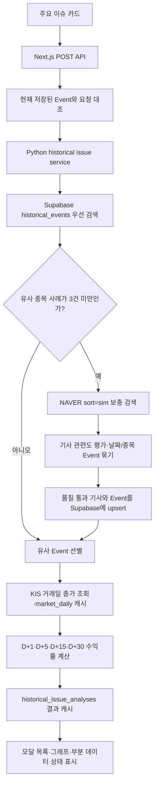

# 과거 유사 이슈를 찾고 주가를 비교하는 방법

StockEcho의 주요 이슈 카드에서 `과거 유사 사례 분석`을 누르면 저장된
과거 Event와 NAVER 뉴스 검색 결과를 이용해 비슷한 사건을 찾고, 사건 이후
D+1·D+5·D+15·D+30번째 거래일 수익률을 비교한다.

이 문서는 데이터 소스를 NAVER로 결정한 이유가 아니라, 결정 이후 제품 기능을
어떻게 연결했는지를 설명한다. 데이터 소스 선택 과정은
[과거 유사 사례 뉴스 데이터는 어디서 가져올까](./과거_유사_사례_뉴스_데이터_소스_결정.md)에서
확인할 수 있다.

## 해결하려는 문제

기존 화면에는 `과거 유사 이슈 보기` 버튼과 예시 디자인이 있었지만 다음 값이
고정된 목업이었다.

- 현재 카드와 관계없는 고정 이슈명과 날짜
- 임의로 만든 유사 기업과 유사도
- 달력일을 기준으로 조회한 가격
- 실제 기사와 연결되지 않은 그래프

MVP에서는 다음 원칙을 지킨다.

- 현재 카드의 종목·Topic·Event·키워드를 그대로 사용한다.
- 이미 저장된 Event를 먼저 사용하고 부족할 때만 NAVER를 호출한다.
- 미래 기사와 관련도 기준을 통과하지 못한 기사는 제외한다.
- 출처가 부족하거나 가격이 없으면 사례와 숫자를 추정해 채우지 않는다.
- 주가 반응은 달력일이 아닌 실제 거래일 순번으로 계산한다.
- 동일 요청은 Supabase 캐시를 사용한다.

## 전체 데이터 흐름



주요 구현 파일은 다음과 같다.

| 역할 | 파일 |
| --- | --- |
| 프론트 요청과 상태 UI | `frontend/src/components/IssueAnalysisModal.tsx` |
| Next.js API 경계 | `frontend/src/app/api/stocks/[stockCode]/historical-issues/route.ts` |
| 전체 오케스트레이션 | `collector/historical_events/service.py` |
| 검색 핵심어 생성 | `collector/historical_events/keywords.py` |
| 과거 Event 유사도와 선별 | `collector/historical_events/search.py` |
| NAVER 단계별 보충 검색 | `collector/jobs/backfill_issue_news.py` |
| 기사 관련도 평가 결과 전달 | `collector/jobs/collect_news_query.py` |
| KIS 일봉 조회 | `collector/clients/kis.py` |
| 거래일 수익률 계산 | `collector/historical_events/price_reaction.py` |
| Supabase 스키마 | `supabase/migrations/202607230003_historical_issue_analysis.sql` |

## 1. 현재 카드 정보를 요청에 전달한다

`StockIssueCard`는 모달에 현재 `StockIssue` 전체와 `stockCode`를 전달한다.
모달은 다음 본문으로 API를 호출한다.

```json
{
  "topicId": "현재 Topic UUID",
  "eventId": "현재 Event UUID",
  "eventDate": "2026-07-23",
  "name": "성과급 1년만에 재협상",
  "topicLabel": "성과급 1년만에 재협상",
  "keywords": ["성과급 협상", "노사 임단협"]
}
```

API는 클라이언트가 보낸 이름과 키워드를 그대로 신뢰하지 않는다.
`getStockIssues(stockCode)`에서 현재 저장된 이슈를 다시 읽고
`topicId`, `eventId`, `eventDate`가 일치하는지 확인한다. 일치하지 않으면
409를 반환하고, 일치하면 서버가 읽은 canonical Event의 이름과 키워드를
Python 서비스에 전달한다.

Python은 shell 문자열을 실행하지 않고 `execFile`과 인자 배열을 사용한다.
서버 Python 경로는 `STOCKECHO_PYTHON`, 저장소 `.venv`, `venv`, `python3`
순서로 선택한다.

## 2. 현재 Event에서 검색 핵심어를 만든다

화면에 표시된 키워드를 전부 NAVER 질의에 넣으면 검색 조건이 지나치게 좁아질
수 있다. 두 종류의 키워드를 분리해서 사용한다.

### 진단용 핵심어

현재 Event 이름, Topic 이름, 카드 키프레이즈에 다음 가중치를 준다.

- Event 이름: 4
- Topic 이름: 3
- 카드 키프레이즈: 2

회사명, 숫자가 포함된 토큰, `관련`, `시장`, `전망`, `발표` 같은 일반어를
제거하고 상위 6개를 `coreKeywords`로 남긴다.

### NAVER 검색어

카드의 첫 번째 유효 키프레이즈에서 사건을 설명하는 2~3개 토큰만 선택한다.
예를 들어 `성과급 협상`은 다음처럼 검색된다.

```text
성과급 협상
```

대표 키프레이즈를 만들 수 없을 때만 `coreKeywords`의 앞부분을 사용한다.
이렇게 하면 `성과급`, `재협상`, `갈등`, `노사`를 모두 AND 조건처럼 넣어
과거 기사가 사라지는 문제를 줄일 수 있다.

## 3. Supabase에 저장된 Event를 먼저 검색한다

검색 전에 로컬 Topic 산출물과 `stock_analysis_results`의 분석 snapshot을
`historical_events`로 동기화한다. Event의 출처는 다음 세 가지다.

- `topic_model`: 로컬 Topic/Event 산출물
- `analysis_snapshot`: Supabase에 저장된 주요 이슈 snapshot
- `naver_backfill`: 과거 유사 이슈 요청으로 만든 NAVER Event proxy

기본 검색 조건은 다음과 같다.

- 현재 Event 기준일 이틀 전보다 오래된 Event
- 현재 Event와 다른 `event_id`
- outlier가 아닌 Event
- 서로 다른 원문 출처가 2곳 이상인 Event
- 핵심어 유사도 40% 이상인 Event

현재 Event 직전 2일을 제외하는 이유는 동일 사건의 연속 보도를 별개의 과거
사례로 다시 선택하지 않기 위해서다.

## 4. 부족하면 NAVER를 단계적으로 검색한다

유사 종목 사례가 3건보다 적을 때만 기존 `backfill_issue_news` 흐름을 실행한다.
모든 질의는 NAVER 뉴스 검색 API의 `sort=sim`을 사용한다.

검색 순서는 다음과 같다.

1. 자사명 + 핵심어
2. 회사명을 제거한 공통 산업·사건 핵심어
3. 동종·지원 기업명 + 핵심어

한 질의는 최대 3페이지, 전체는 최대 12회까지만 호출한다. 필요한 사례가
확보되면 뒤 단계와 다음 페이지를 호출하지 않는다.

NAVER 검색 결과 전체가 Supabase로 올라가는 것은 아니다.

1. 현재 Event 기준일 이후 기사를 제거한다.
2. 기존 기사 관련도 평가에서 `eligible`인 기사만 남긴다.
3. 같은 날짜·종목의 기사를 하나의 Event proxy로 묶는다.
4. 원문 도메인의 `www.`를 제거한 뒤 서로 다른 출처를 센다.
5. 원문 출처가 2곳 이상인 Event만 저장한다.

품질을 통과한 Event의 기사만 `news_articles`와 `article_stocks`에 upsert되고,
Event proxy는 `historical_events`에 저장된다. NAVER 원본 응답과 검색
checkpoint는 로컬 `data/raw`, `data/state`, `data/processed`에 남는다.

## 5. 과거 Event 유사도를 계산한다

현재 유사도는 문장 임베딩이나 주가 패턴이 아니라 **핵심어 포함률을 이용한
규칙 기반 점수**다.

```text
유사도 =
  전체 텍스트 핵심어 포함률 × 0.45
+ Event 이름·키워드 포함률 × 0.30
+ Topic 이름·키워드 포함률 × 0.15
+ 핵심 문구 일치율 × 0.10
```

`전체 텍스트`에는 다음 값이 들어간다.

- 과거 Event 이름과 키워드
- 상위 Topic 이름과 키워드
- 현재 검색어와 가장 많이 겹치는 대표 기사의 제목과 요약

대표 기사는 Event에 속한 기사 중 현재 검색 토큰이 가장 많이 등장하는 기사를
먼저 고르고, 동률이면 기사 관련도와 발행 시각을 사용한다.

예를 들어 현재 검색 핵심어가 `성과급`, `협상`이고 두 단어가 과거 Event의
이름·키워드·대표 기사에 모두 충분히 나타나면 100%에 가까워진다.

따라서 화면의 100%는 사건이 의미적으로 완전히 동일하다는 뜻이 아니라,
선택한 핵심어가 과거 Event 자료에 모두 포함됐다는 뜻이다. 현재 점수에는
업종 동일 여부, 기업 규모, 주가 상관관계, D+ 수익률, 호재·악재 방향이
포함되지 않는다.

후보는 유사도, 기사 수, 출처 수, 최근 날짜 순으로 정렬한다. 자사 Event는
가장 높은 한 건만 선택하고, 다른 회사는 가능한 서로 다른 회사를 우선해
최대 3건을 선택한다. 기준을 통과한 사례가 부족하면 개수를 억지로 채우지
않는다.

## 6. 거래일 기준 수익률을 계산한다

KIS 일봉은 `market_daily`에 `(stock_code, trading_date)`로 upsert한다.
이미 필요한 기간의 가격이 있으면 저장값을 먼저 사용하고, 부족할 때만 KIS를
조회한다.

기준 거래일은 대표 기사 발행 시각에 따라 결정한다.

- Event 당일 15시 20분 전 기사: Event 당일 종가
- 15시 20분 이후 기사: 다음 거래일 종가
- 주말·휴일 기사: 다음 거래일 종가
- 발행 시각을 해석할 수 없는 기사: 다음 거래일 종가

가격 행을 날짜순으로 정렬한 뒤 기준 거래일의 다음 1·5·15·30번째 행을 찾는다.
주말과 휴일은 가격 행이 없으므로 자연스럽게 건너뛴다. 거래정지나 가격 누락도
존재하지 않는 행을 달력일 가격으로 추정하지 않는다.

```text
수익률(%) = (비교 거래일 종가 / 기준 거래일 종가 - 1) × 100
```

아직 D+30 거래일에 도달하지 않았거나 가격을 가져오지 못하면 해당 값은
`null`이고 Event의 가격 상태는 `partial` 또는 `unavailable`이 된다.

## 7. 동일 요청을 캐시한다

최종 분석 캐시는 `historical_issue_analyses`에 저장한다. 캐시 키에는 다음
값이 들어간다.

- schema version
- 종목 코드
- 현재 Topic/Event ID와 기준일
- 현재 Event 이름과 검색 핵심어
- 최소 출처 수와 최소 유사도
- 전체 결과 수와 유사 종목 결과 수
- 현재 Event 제외 기간

동일 키 요청은 NAVER와 KIS를 다시 호출하지 않고 `ready` 결과를 반환한다.
동시에 같은 요청이 들어오는 경우 PostgreSQL advisory lock으로 한 요청만
분석을 수행한다.

NAVER backfill 자체도 schema version, 종목, 기준일, 검색 문구, 결과 제한을
포함한 `issue_search_<hash>` 파일로 캐시한다. 다만 제품의 반복 요청 방지는
Supabase 최종 결과 캐시가 우선한다.

현재 분석 schema는 `historical-issue-analysis-v6`이다. 검색·선별 규칙을
바꿀 때 schema version을 올리면 이전 결과를 새 규칙의 캐시로 재사용하지
않는다.

## 8. 화면 상태를 실제 데이터에 맞춰 나눈다

모달은 다음 상태를 별도로 처리한다.

- `loading`: 현재 이슈와 스켈레톤, 저장 Event → NAVER → 거래일 가격 흐름
- `error`: 안전한 오류 문구와 재시도
- `insufficient`: 품질 기준을 통과한 사례 없음
- `partial`: 사례 수 또는 일부 D+ 가격이 부족함
- `ready`: 자사 최대 1건과 유사 종목 최대 3건 및 비교 그래프

그래프는 D-0을 0%로 두고 실제로 확보한 D+1·D+5·D+15·D+30 관측점만
연결한다. 중간 날짜의 일별 경로를 추정하지 않는다. 심각도, 평균 회복 기간,
임의의 데이터 신뢰도처럼 현재 데이터로 계산할 수 없는 값도 표시하지 않는다.

NAVER가 전체 과거 뉴스 아카이브가 아니라는 한계와 과거 수익률이 미래 수익률을
보장하지 않는다는 안내를 항상 표시한다.

## Supabase 테이블 역할

| 테이블 | 저장 내용 |
| --- | --- |
| `news_articles` | 품질 통과 Event에 포함된 정규화 기사 |
| `article_stocks` | 기사·종목·검색어별 관련도와 `eligible` 상태 |
| `historical_events` | 날짜·종목별 Event, 대표 기사, 기사 목록, 출처 수 |
| `historical_issue_analyses` | 요청 context와 최종 API 결과 캐시 |
| `market_daily` | KIS 거래일 종가 캐시 |

`historical_events`, `historical_issue_analyses`, `market_daily`에는 RLS가
활성화되어 있다. API Key와 DB 연결 문자열은 코드·로그·문서에 기록하지 않고
서버 환경변수로만 주입한다.

## 검증 방법

Python 전체 회귀 테스트:

```bash
.venv/bin/python -m unittest discover -s tests -v
```

변경 프론트 정적 검사:

```bash
cd frontend
npx eslint src/components/IssueAnalysisModal.tsx \
  'src/app/api/stocks/[stockCode]/historical-issues/route.ts' \
  src/components/StockIssueCard.tsx \
  src/lib/historicalIssues.ts
npx tsc --noEmit
npm run build
```

실제 요청에서는 다음 항목을 확인한다.

- 현재 Event 이후 기사 0건
- 모든 반환 Event의 출처 수가 2 이상
- 대표 기사와 유사 근거가 존재
- 자사 최대 1건, 유사 종목 최대 3건
- D+ 날짜가 달력일이 아니라 저장된 거래일 순번
- 두 번째 동일 요청의 `cacheHit`이 `true`

## 현재 한계와 다음 개선

### NAVER 검색 범위

NAVER 검색 API는 전체 역사 뉴스 아카이브가 아니다. 품질 기준을 통과하는 사례가
부족하면 결과가 1~2건이거나 없을 수 있다. OpenDART는 향후 공식 기업 사건
보완 소스로 사용할 수 있지만 현재 핵심 흐름에는 포함하지 않는다.

### 유사도 의미

현재 점수는 핵심어 유사도다. 의미 유사도를 높이려면 한국어 문장 임베딩,
사건 분류, 영향 방향을 별도 특징으로 계산하고 현재 점수와 결합해야 한다.
그전까지 UI 라벨은 `핵심어 유사도`가 더 정확하다.

### KIS 토큰과 가격 범위

Python과 Next.js가 각각 메모리에서 KIS 토큰을 관리하므로 프로세스 재시작이나
동시 요청에서 토큰 발급 제한에 걸릴 수 있다. 운영에서는 공유 토큰 캐시와
발급 lock을 두거나 KIS 호출을 하나의 서버 gateway로 모아야 한다.

### 배포 구조

현재 Next.js Route Handler는 같은 서버의 Python 프로세스를 실행한다.
Next.js와 collector가 같은 VM에 배포되고 `STOCKECHO_PYTHON`이 설정된
환경에서는 동작하지만, 프론트만 serverless에 배포하면 같은 방식으로 실행할
수 없다. 이 경우 분석 전용 Python API나 Supabase Queue worker로 경계를
분리해야 한다.

### 데이터 보존

schema version을 올리면 이전 Event와 캐시는 검색에서 제외되지만 DB에는
남는다. 운영 단계에서는 오래된 `naver_backfill` Event와 분석 캐시의 보존
기간, 삭제 작업, 실패율 모니터링을 추가해야 한다.
