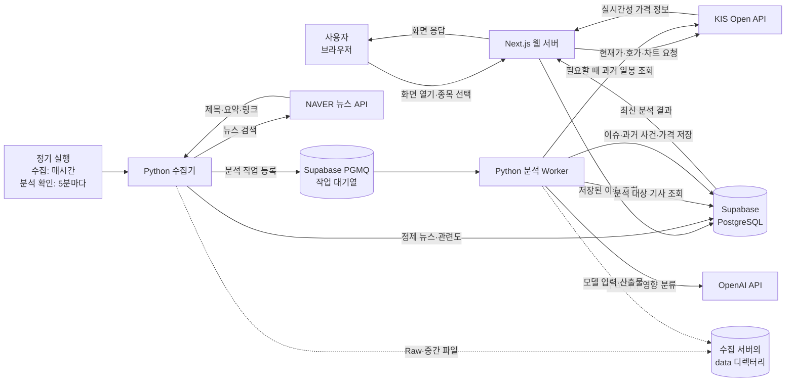
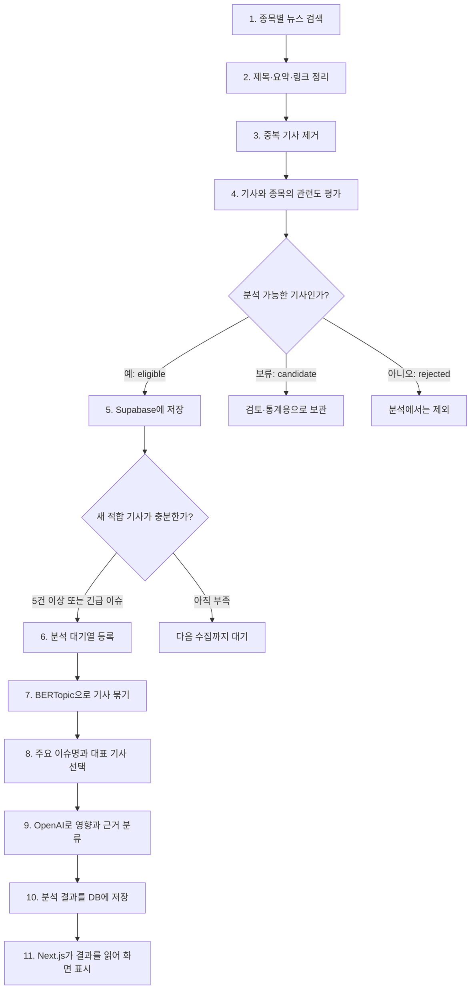

# 서버와 DB는 왜 필요하고 어떻게 동작할까

> 이 문서는 StockEcho의 현재 구현을 기준으로, 서버와 데이터베이스가 왜 필요한지와 뉴스가 화면에 나타나기까지의 과정을 비개발자도 이해할 수 있도록 설명한다.

## 한 문장으로 이해하기

StockEcho의 **서버는 데이터를 가져오고 분석하는 일꾼**이고, **DB는 그 결과를 안전하게 기억하고 여러 화면에 전달하는 공용 창고**다.

사용자가 화면을 열 때마다 수천 건의 뉴스를 새로 검색하고 분석하는 대신, 서버가 미리 작업해 DB에 저장한다. 화면은 저장된 최신 결과를 빠르게 읽어서 보여준다.

## 서버와 DB가 각각 필요한 이유

### 서버가 필요한 이유

브라우저만으로는 다음 작업을 안전하고 안정적으로 수행하기 어렵다.

- NAVER, KIS, OpenAI 같은 외부 API의 비밀 키를 숨겨야 한다.
- 사용자가 접속하지 않는 시간에도 정기적으로 뉴스를 수집해야 한다.
- 수천 건의 기사에 관련도 판정과 BERTopic 분석을 실행해야 한다.
- 같은 API를 불필요하게 여러 번 호출하지 않도록 순서와 횟수를 관리해야 한다.
- 분석 실패 시 다른 종목은 계속 처리하고 실패한 작업만 재시도해야 한다.

따라서 StockEcho 서버는 두 역할을 맡는다.

1. **웹 서버**: 사용자의 화면 요청에 응답하고 현재가와 저장된 분석 결과를 전달한다.
2. **수집·분석 서버**: 정해진 시간마다 뉴스를 모으고 분석한 뒤 DB에 저장한다.

현재 이 두 역할은 논리적으로 분리되어 있지만 별도 FastAPI 서버는 사용하지 않는다. 화면 요청은 Next.js가 처리하고, 오래 걸리는 수집·분석은 Python 작업이 처리한다.

### DB가 필요한 이유

서버가 수집한 데이터를 파일이나 메모리에만 보관하면 서버 재시작이나 배포 시 데이터가 사라질 수 있고, 여러 서버가 같은 최신 결과를 사용하기도 어렵다.

Supabase PostgreSQL DB는 다음을 책임진다.

- 같은 기사를 중복 저장하지 않는다.
- 기사와 관련 종목의 연결 관계를 기억한다.
- 어떤 종목이 분석 대기·실행·완료·실패 상태인지 기록한다.
- 최신 이슈 분석 결과를 화면에 제공한다.
- 과거 유사 사건과 주가 데이터를 다시 사용할 수 있게 보관한다.
- 동일한 과거 분석 요청이 들어오면 외부 API를 다시 호출하지 않고 캐시를 반환한다.

즉, 서버가 잠시 멈춰도 이미 정상 저장된 데이터는 DB에 남아 있다.

## 현재 사용 중인 구성

| 구분 | 사용 기술 | 하는 일 |
|---|---|---|
| 사용자 화면 | Next.js, React | 포트폴리오, 현재가, 주요 이슈, 과거 유사 사례 표시 |
| 웹 서버 | Next.js Route Handler, Server Component | 브라우저 요청 처리, DB 조회, KIS API 중계 |
| 수집·분석 작업 | Python | 뉴스 수집, 정규화, 관련도 판정, 이슈 분석 |
| 뉴스 원천 | NAVER 뉴스 검색 API | 회사명과 발견된 이슈 검색어로 뉴스 수집 |
| 가격 원천 | 한국투자증권 KIS Open API | 현재가·호가·차트 조회와 과거 일봉 수집 |
| 영향 분류 | OpenAI API | 주요 이슈의 카테고리, 영향 방향과 근거 분류 |
| 텍스트 분석 | Kiwi, TF-IDF, BERTopic, 문장 임베딩 | 검색어 발견, 기사 군집화, 주요 이슈 생성 |
| 공용 DB | Supabase PostgreSQL | 정제 뉴스, 분석 상태와 결과, 과거 사건, 일봉 저장 |
| 작업 대기열 | Supabase PGMQ | 분석할 종목의 순서, 재시도 상태 보존 |
| 브라우저 저장소 | localStorage | 사용자가 선택한 종목과 수량을 해당 브라우저에 저장 |

OpenDART 공시 수집은 아키텍처 문서에는 계획되어 있지만 **현재 실행 코드에는 아직 연결되어 있지 않다**. Supabase Storage도 현재 핵심 데이터 흐름에는 사용하지 않으며, 정제 전 Raw 뉴스와 중간 분석 파일은 수집 서버의 `data/` 디렉터리에 저장한다.

## 전체 아키텍처 구조도

이 구조에서 사용자의 브라우저는 NAVER나 OpenAI를 직접 호출하지 않는다. 비밀 키가 필요한 요청은 항상 서버가 대신 처리한다.

## 뉴스 한 건이 화면에 나타나는 과정

뉴스가 수집됐다고 모두 화면에 나타나는 것은 아니다. StockEcho는 회사명만 우연히 언급된 기사, 여러 종목을 나열한 시황 기사, 채용·홍보성 기사 등을 관련도 규칙으로 걸러낸다.

## 실제 데이터가 저장되는 위치

### `stocks`: 지원 종목 목록

종목 코드, 회사명, 업종과 검색 별칭을 저장한다. 다른 테이블은 이 종목 코드를 기준으로 연결된다.

### `news_articles`: 중복 제거된 뉴스

기사 한 건당 한 행을 저장한다.

- 제목
- 요약
- 발행 시각
- 원문 링크
- 출처
- 중복 판별용 해시

같은 기사가 삼성전자와 SK하이닉스에 모두 관련되어도 이 테이블에는 한 번만 들어간다.

### `article_stocks`: 뉴스와 종목의 연결

한 기사가 어떤 검색어로 발견됐고 특정 종목과 얼마나 관련 있는지 저장한다.

- `eligible`: 실제 이슈 분석에 사용
- `candidate`: 검토·통계용으로 보관
- `rejected`: 분석에서 제외

한 기사에 여러 종목이나 여러 검색어가 연결될 수 있으므로 `news_articles`보다 행 수가 많다.

### `stock_analysis_state`: 종목별 작업 상태

종목마다 한 행이 있으며 현재 상태를 보여준다.

- `idle`: 대기 중
- `queued`: 분석 순서를 기다리는 중
- `running`: 분석 중
- `ready`: 최신 결과 사용 가능
- `insufficient_data`: 분석할 기사가 부족함
- `failed`: 분석 실패

대기 기사 수, 마지막 분석 시각, 재시도 횟수와 오류 내용도 함께 저장한다.

### `stock_analysis_results`: 화면용 주요 이슈 결과

종목별 분석 결과를 JSON 형태의 스냅샷으로 저장한다.

- 주요 이슈명과 순위
- 대표 기사와 관련 기사
- 이슈 카테고리
- 긍정·부정·중립·혼합 영향
- 판단 신뢰도와 근거
- 모델 버전과 분석 기준일

홈 화면의 주요 이슈 카드는 이 테이블의 최신 결과를 읽는다.

### `historical_events`: 과거 유사 사건 후보

날짜별 사건명, 핵심어, 대표 기사와 관련 기사들을 저장한다. 현재 이슈와 의미가 비슷한 과거 사건을 찾을 때 우선 검색한다.

### `historical_issue_analyses`: 과거 유사 사례 분석 캐시

현재 사건과 과거 사건을 비교한 최종 결과를 저장한다. 같은 요청을 반복하면 NAVER와 KIS를 다시 호출하지 않고 저장된 결과를 사용한다.

### `market_daily`: 과거 일봉 가격

KIS에서 받은 종목별 거래일 종가를 저장한다. 사건 발생 후 1·5·15·30번째 거래일의 주가 변화를 계산할 때 사용한다.

현재가와 호가는 빠르게 변하므로 DB에 영구 저장하지 않고, 사용자가 화면을 볼 때 Next.js 서버가 KIS에서 조회한다.

### `pgmq.q_stock_analysis`: 분석 대기열

어느 종목을 왜 분석해야 하는지 순서대로 보관한다. 분석이 성공하면 보관 큐로 이동하고, 실패하면 일정 시간이 지난 뒤 다시 시도한다.

## 화면을 열었을 때 일어나는 일

사용자가 삼성전자 화면을 연다고 가정하면 다음 순서로 움직인다.

1. 브라우저가 Next.js 서버에 삼성전자 화면을 요청한다.
2. Next.js는 KIS에 현재가·호가·차트를 요청한다.
3. Next.js는 Supabase에서 삼성전자의 최신 주요 이슈 스냅샷을 읽는다.
4. 두 결과를 합쳐 브라우저에 전달한다.
5. 사용자가 `과거 유사 사례 분석`을 누르면 저장된 분석 캐시를 먼저 찾는다.
6. 캐시가 없을 때만 Python 분석 작업이 과거 사건과 일봉을 조회해 결과를 만든다.

이 과정에서 사용자가 선택한 보유 종목과 수량은 해당 브라우저의 `localStorage`에만 들어간다. 현재는 사용자 포트폴리오를 Supabase에 저장하지 않는다.

## 정기 수집과 분석은 어떻게 계속 실행될까

운영 설정은 Linux의 `systemd timer`를 사용한다.

| 작업 | 실행 주기 | 역할 |
|---|---|---|
| 뉴스 수집기 | 매시간 10분경 | 지원 종목 뉴스를 수집하고 관련도를 계산한 뒤 필요한 분석을 큐에 등록 |
| 분석 Worker | 약 5분마다 | 큐에서 한 종목을 가져와 BERTopic 분석 후 결과 저장 |

한 번의 실행에서 여러 종목 중 하나가 실패해도 다른 종목의 뉴스 수집은 계속된다. 분석 작업은 기본적으로 최대 세 번 읽힌 뒤에도 실패하면 보관 큐로 이동하며, 상세 오류는 `stock_analysis_state`에 남는다.

## 문제가 생겨도 전부 멈추지 않는 이유

각 기능은 서로 다른 방식으로 실패를 격리한다.

| 문제 | 서비스가 보이는 동작 |
|---|---|
| KIS 현재가 API 일시 장애 | 현재가 영역만 갱신되지 않고 저장된 이슈 데이터는 계속 조회 가능 |
| NAVER 뉴스 API 일시 장애 | 신규 뉴스 수집은 늦어지지만 기존 분석 결과는 DB에 유지 |
| OpenAI 분류 실패 | 규칙 기반 분류로 대체하고 이슈 분석 자체는 계속 진행 |
| 특정 종목 분석 실패 | 해당 종목만 `failed`로 기록하고 다른 종목 작업은 계속 처리 |
| Next.js 재시작 | DB에 저장된 뉴스와 분석 결과는 유지 |
| 분석 요청 중복 | 이미 `queued` 또는 `running`이면 같은 종목 작업을 다시 만들지 않음 |

따라서 “서버가 정상인가”와 “모든 종목의 최신 분석이 성공했는가”는 별도로 확인해야 한다. 웹 화면과 DB가 정상이어도 특정 종목 분석만 실패할 수 있다.

## 운영 상태를 확인할 때 보는 항목

비개발자가 운영 상태를 확인할 때는 다음 네 가지를 구분하면 된다.

1. **웹 서버**: 메인 화면과 API가 정상 응답하는가?
2. **수집 상태**: `news_articles`의 최근 저장 시각이 계속 갱신되는가?
3. **분석 상태**: `stock_analysis_state`에 장시간 멈춘 `queued`, `running` 또는 반복되는 `failed`가 있는가?
4. **DB 용량**: 데이터가 한도에 가까워지고 있지 않은가?

현재 데이터 규모에서는 기사 원문보다 기사-종목 연결 정보인 `article_stocks`가 가장 큰 테이블이다. 지원 종목과 검색어가 늘어나면 이 테이블이 가장 빠르게 증가할 가능성이 높다.

## 현재 구조에서 기억할 점

- 사용자는 외부 API와 Supabase를 직접 제어하지 않고 Next.js 서버를 통해 결과를 받는다.
- 뉴스 수집과 무거운 분석은 사용자의 화면 요청과 분리되어 백그라운드에서 실행된다.
- Supabase는 원본 API 응답 전체가 아니라 정제된 뉴스와 분석 결과를 저장한다.
- Raw 뉴스와 중간 분석 파일은 현재 수집 서버 디스크에 있으며 Supabase Storage에는 없다.
- 현재가·호가는 실시간 조회 데이터이고, 과거 일봉만 필요할 때 DB에 캐시한다.
- OpenDART 공시 수집은 아직 현재 실행 흐름에 포함되지 않았다.
- 기획 문서는 지원 종목 20개를 기준으로 하지만 현재 백엔드 목록과 종목 추가 화면에는 한미반도체가 더해져 21개가 등록되어 있다.

## 앞으로 개선할 부분

- 백엔드, 종목 추가 화면, 종목 상세 화면의 지원 종목 목록을 하나의 기준정보로 통합
- OpenDART 공시 수집기를 실제 데이터 흐름에 연결
- 수집 서버의 Raw·중간 파일 보관 주기와 삭제 정책 확정
- 웹 서버·수집기·Worker의 상태를 한눈에 보는 운영 대시보드 추가
- 특정 종목의 `failed` 상태가 반복될 때 자동 알림 추가
- 데이터 증가 속도를 기준으로 DB 용량 경고선 설정

