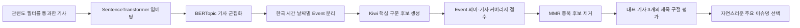

# 주요 이슈 제목을 뽑는 방법

> 비슷한 뉴스 기사를 BERTopic으로 묶고, Kiwi·임베딩·MMR로 자연스러운 대표 이슈 제목을 선택한 구현 이야기

## 1. 목적

StockEcho는 여러 언론사가 같은 사건을 보도한 기사를 하나의 이슈로 묶고, 포트폴리오 화면에 사람이 이해하기 쉬운 주요 이슈명을 보여준다.

초기에는 Kiwi로 많이 등장한 단어 세 개를 골라 다음과 같이 표시했다.

```text
로봇 · 사업 · 신설
카드 · 출시 · 갤럭시
```

이 방법은 핵심 단어를 확인하기에는 좋지만 자연스러운 이슈명으로 보기 어렵다. 현재는 LLM이 새로운 문장을 생성하지 않고, 실제 기사 제목에서 가장 적절한 구절을 선택하는 **추출형 의미 기반 라벨링** 방식을 사용한다.

현재 라벨링 버전은 다음과 같다.

```text
extractive-semantic-mmr-v1
```

## 2. 전체 처리 흐름



BERTopic은 유사 기사를 Topic으로 묶는다. 하나의 Topic 안에서도 서로 다른 날 발생한 사건이 섞일 수 있으므로, 기사를 `Asia/Seoul` 기준 발행일별 Event로 다시 나눈다. 이슈명은 Topic 전체가 아니라 이 날짜별 Event를 기준으로 생성한다.

## 3. 사용 기술

### 3.1 BERTopic

기사 본문 임베딩을 UMAP과 HDBSCAN으로 군집화한다. BERTopic 숫자 ID는 실행마다 바뀔 수 있으므로 외부 영구 ID로 사용하지 않는다.

Topic과 Event의 외부 참조 ID는 다음 값을 바탕으로 만든 UUIDv5를 사용한다.

- `model_version`
- 종목 코드
- 소속 기사 문서 ID fingerprint

### 3.2 Kiwi 형태소 분석

Kiwi는 한국어 제목에서 명사, 동사, 형용사와 영문 표현을 추출한다.

```text
삼성전자, 대표이사 직속 RX사업추진실 신설…로봇사업 본격화

→ 삼성전자 / 대표 / 이사 / 직속 / RX / 사업 / 추진 / 신설 / 로봇 / 사업 / 본격화
```

회사명과 `[단독]`, `[속보]`, `[르포]` 같은 편집 표현은 후보에서 제외한다.

남은 토큰을 연결해 2~3어절 후보 구문을 만든다.

```text
대표 이사 직속
직속 RX 사업
사업 추진 신설
신설 로봇 사업
```

### 3.3 한국어 SentenceTransformer 임베딩

기본 모델은 다음과 같다.

```text
jhgan/ko-sroberta-multitask
```

기사와 후보 구문을 의미 벡터로 변환한다. 같은 Event에 속한 모든 기사 벡터의 평균을 Event 중심 벡터로 사용한다.

후보 구문이 Event 중심에 가까울수록 해당 사건을 잘 설명하는 표현으로 판단한다.

### 3.4 기사 커버리지

한 기사에만 등장하는 표현보다 여러 기사 제목에 공통으로 등장하는 표현에 높은 점수를 준다.

후보 구문의 기본 점수는 다음과 같다.

```text
후보 구문 점수
= Event 중심과의 의미 유사도 × 0.72
 + 후보가 등장한 기사 비율      × 0.28
```

의미가 가깝더라도 일부 기사에만 등장하는 주변 표현은 낮아지고, Event 전체에서 반복되는 핵심 표현은 높아진다.

### 3.5 MMR

MMR(Maximal Marginal Relevance)은 의미가 비슷한 후보가 반복 선택되는 것을 줄인다.

```text
로봇 사업
로봇사업 확대
로봇 사업 본격화
```

위 표현을 모두 선택하는 대신 다음처럼 서로 다른 정보를 포함한 후보를 남긴다.

```text
신설 로봇 사업
대표 이사 직속
사업 추진 신설
```

현재 MMR 다양성 값은 `0.2`다. 대표성을 우선하면서 지나친 중복만 줄이는 설정이다.

## 4. 자연스러운 이슈명을 만드는 방법

이 시스템은 단어를 이어 붙여 새로운 문장을 만들지 않는다. 기자가 이미 자연스럽게 작성한 기사 제목에서 적절한 구절을 선택한다.

### 4.1 대표 기사 선택

같은 Event에 포함된 기사 중 Event 임베딩 중심에 가장 가까운 기사를 우선한다. 점수가 같으면 관련도, 발행 시각, 문서 ID를 사용해 결정적인 순서를 만든다.

이슈명 후보는 중심에 가까운 대표 기사 세 개에서만 가져온다. Event 전체의 모든 기사에서 후보 문장을 가져오면 주변 기사나 잘못 군집화된 기사의 문구가 선택될 가능성이 커지기 때문이다.

### 4.2 기사 제목 분할

기사 제목을 쉼표, 말줄임표, 구분선 등을 기준으로 나눈다.

```text
삼성전자,
대표이사 직속 'RX사업추진실' 신설
로봇사업 본격화
```

그다음 다음 표현을 제거하거나 제외한다.

- 회사명만 있는 구절
- `[단독]`, `[속보]`, `[르포]` 등의 편집 표시
- NAVER 제목 말줄임으로 단어가 중간에 잘린 구절
- 핵심 구문을 하나도 포함하지 않는 주변 문구

### 4.3 최종 구절 점수

대표 기사에서 추출한 각 구절은 다음 기준으로 평가한다.

```text
최종 구절 점수
= Event 중심과의 의미 유사도    × 0.42
 + Event 기사 전체 대표성        × 0.23
 + 핵심 구문 포함 정도           × 0.20
 + 대표 기사 순위                × 0.10
 + 화면에 적절한 문구 길이       × 0.05
```

인수 보도와 부인 보도가 한 Event에 같이 있을 때는 한쪽을 사실로 단정하지 않도록 중립적인 표현을 우선한다.

```text
인텔 오하이오 공장 산다
인텔 오하이오 공장 인수설 사실무근

→ 인텔 오하이오 공장 인수설
```

이 중립화 점수는 해당 Event에서 부인이나 반박 표현이 실제로 확인된 경우에만 적용한다.

## 5. 결과 예시

### 삼성전자

| 후보 기사 제목 | 생성된 주요 이슈명 |
|---|---|
| 삼성전자, 대표이사 직속 'RX사업추진실' 신설…로봇사업 본격화 | 대표이사 직속 'RX사업추진실' 신설 |
| 삼성, 미국서 첫 '갤럭시 카드' 출시…삼성 월렛 연동으로 애플 카드 맞... | 미국서 첫 '갤럭시 카드' 출시 |
| 런던 랜드마크 장식한 보랏빛 ‘갤럭시 언팩’…폴더블폰 공개 준비 막... | 런던 랜드마크 장식한 보랏빛 ‘갤럭시 언팩’ |

### SK하이닉스

| 후보 기사 제목 | 생성된 주요 이슈명 |
|---|---|
| SK하이닉스, 성과급 1년 만에 재협상…노사 집중교섭 돌입 | 성과급 1년 만에 재협상 |
| SK하이닉스 "인텔 오하이오 공장 인수설 사실무근" | 인텔 오하이오 공장 인수설 |
| 李, N% 성과급에 “노동쟁의 대상 아니다” | N% 성과급에 “노동쟁의 대상 아니다” |

## 6. 저장 구조

Event와 주요 이슈 결과에는 화면용 이름, 보조 키프레이즈, 생성 방식을 함께 저장한다.

```json
{
  "name": "대표이사 직속 'RX사업추진실' 신설",
  "keywords": [
    "신설 로봇 사업",
    "대표 이사 직속",
    "사업 추진 신설"
  ],
  "label_method": "extractive-semantic-mmr-v1"
}
```

`name`은 포트폴리오의 #1~#3 주요 이슈 제목에 사용한다. `keywords`는 분석 근거, 검색, 향후 과거 Event 유사도 비교 등에 사용할 수 있다.

## 7. LLM을 사용하지 않는 이유와 장점

현재 방식은 문장을 새로 생성하지 않고 실제 기사 제목의 구절을 사용한다.

장점은 다음과 같다.

- API 호출 비용이 없다.
- 로컬과 Colab에서 동일하게 실행할 수 있다.
- 같은 입력과 모델 버전에서 결과를 재현하기 쉽다.
- 기사에 없는 내용을 새로 만들어낼 가능성이 작다.
- 어떤 기사 문구를 선택했는지 설명할 수 있다.

## 8. 한계

다음 상황에서는 결과 품질이 떨어질 수 있다.

- Event에 기사가 2~3개뿐인 경우
- 언론사 제목이 모두 지나치게 짧거나 말줄임된 경우
- 하나의 BERTopic 군집에 서로 다른 사건이 섞인 경우
- 기사 제목이 자극적이거나 사실관계를 단정하는 경우
- 실제로 새로운 요약 문장을 만들어야 이해 가능한 경우

따라서 이 방식은 자연스러운 문구를 새로 작성하는 생성형 요약이 아니라, 가장 적절한 기존 문구를 선택하는 방식이다.

## 9. 향후 LLM 연결 지점

현재 결과가 부족한 Event에만 선택적으로 LLM을 적용할 수 있다.

권장 조건은 다음과 같다.

- 최종 구절 점수가 기준값보다 낮다.
- 대표 기사 사이의 의미 일치도가 낮다.
- 선택된 이름이 너무 짧거나 잘린 표현이다.
- 상반된 주장 때문에 중립적인 추출 문구를 만들기 어렵다.

LLM 입력은 전체 본문 대신 다음 정보로 제한한다.

- 대표 기사 제목 최대 3개
- 의미 기반 핵심 구문 최대 5개
- 회사명과 Event 날짜

LLM 결과에는 별도 `label_method`와 모델 버전을 기록한다.

```json
{
  "name": "인텔 오하이오 공장 인수설 부인",
  "label_method": "llm-label-v1",
  "label_model": "<model-name>"
}
```

이 구조를 사용하면 현재 추출형 결과를 기본값으로 유지하면서, 품질이 부족한 일부 Event만 생성형 방식으로 보완할 수 있다.

## 10. 관련 구현

- `collector/topic_modeling/event_labeling.py`: 후보 구문 생성, 의미 점수, MMR, 최종 구절 선택
- `collector/topic_modeling/pipeline.py`: 기사 임베딩과 Event 라벨러 연결
- `collector/topic_modeling/results.py`: Event/주요 이슈 JSONL 변환
- `tests/test_topic_modeling.py`: 한국어 구문, 제목 분할, 말줄임, 중립화 테스트
