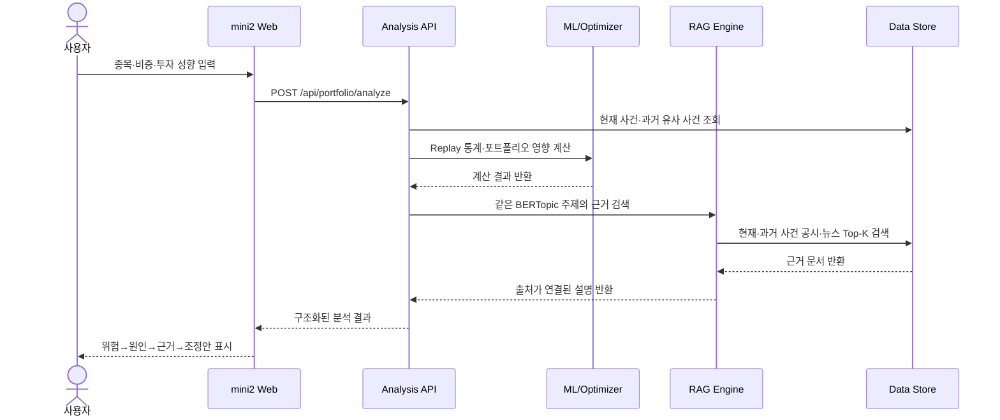
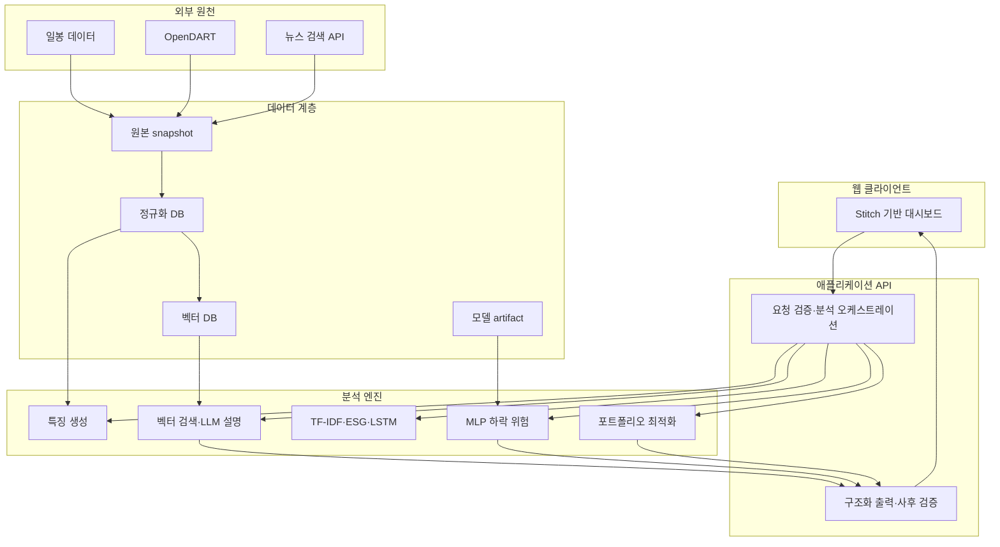

# mini2 제품 요구사항 문서(PRD)

> **제품명**: mini2  
> **버전**: v1.0 Draft  
> **작성 기준일**: 2026-07-18  
> **문서 상태**: 팀 합의 및 개발 착수용  
> **제품 정의**: 공시·뉴스 근거 기반 개인 포트폴리오 위험 진단 및 리밸런싱 시뮬레이션

---

## 1. 제품 요약

### 1.1 Elevator Pitch

mini2는 공시·뉴스에서 현재 기업의 위험사건을 감지하고, BERTopic과 RAG로 과거 유사 사건을 찾은 뒤, 사건 이후 1일·5일·20일 주가 반응과 사용자의 포트폴리오 영향을 보여주는 교육용 투자 의사결정 서비스다. 핵심 기능의 작업명은 **Risk Replay**다.

### 1.2 핵심 문제

개인 투자자는 다음 세 종류의 정보를 각각 확인해야 한다.

- 가격·거래량과 같은 수치 정보
- 공시·뉴스와 같은 비정형 텍스트
- 전체 포트폴리오 안에서 각 종목이 만드는 위험

기존 서비스는 데이터는 많지만 사용자가 “그래서 내 포트폴리오에서 무엇을 먼저 확인해야 하는가?”를 판단하기 어렵다. 생성형 AI만 사용하면 설명은 쉽지만 근거 없는 판단과 숫자를 만들 수 있다.

### 1.3 해결 가설

> 현재 사건과 같은 주제의 과거 사례 및 실제 시장 반응을 함께 보여주면, 사용자는 단순 위험점수보다 더 구체적이고 검증 가능한 판단 근거를 얻을 수 있다.

### 1.4 제품 원칙

1. **계산과 설명을 분리한다.** 수치는 모델, 설명은 RAG가 담당한다.
2. **출처 없는 판단을 보여주지 않는다.** 근거가 부족하면 부족하다고 말한다.
3. **수익을 약속하지 않는다.** 위험 진단과 시뮬레이션만 제공한다.
4. **최신성보다 안정성을 속이지 않는다.** 데이터 기준시각을 항상 표시한다.
5. **핵심 데모 흐름을 우선한다.** 종목 수와 기능 수보다 E2E 완성도를 우선한다.

---

## 2. 목표와 비목표

### 2.1 제품 목표

- 포트폴리오 입력 후 가장 위험한 종목과 원인을 10초 이내에 확인하게 한다.
- 가격·공시·뉴스를 기업 및 날짜 기준으로 통합한다.
- 수업에서 배운 MLP·NLP·TF-IDF·LSTM·BERTopic을 투자 위험 문제에 적용한다.
- 현재 사건과 같은 주제의 과거 사건을 찾아 사건 후 실제 주가 반응을 계산한다.
- 논문 기반 포트폴리오 최적화 코드를 실행 가능하고 검증 가능한 형태로 구현한다.
- RAG 답변에 문서명·발행일·원문 링크를 제공한다.
- 기존 포트폴리오와 제안 포트폴리오의 위험 차이를 시각화한다.
- 외부 API와 LLM 장애에도 발표용 핵심 흐름을 유지한다.

### 2.2 Non-Goals

- 실제 투자자문 또는 자동매매
- 증권계좌 연결과 주문 실행
- 종목의 목표가·확정 수익률 제시
- 초 단위 실시간 시세 처리
- 한국 상장 종목 전체 지원
- 뉴스 본문 무제한 저장·재배포
- 딥러닝 모델이 직접 포트폴리오 비중을 자유롭게 생성
- 로그인·결제·커뮤니티·소셜 기능

---

## 3. 사용자 정의

### 3.1 Primary Persona

**이름**: 김초보, 29세 개인 투자자  
**상황**: 대형주 3~5개를 보유하고 있으나 공시와 재무 용어가 어렵다.  
**목표**: 수익 극대화보다 큰 손실 가능성을 먼저 파악하고 싶다.  
**행동**: 뉴스 제목은 보지만 원문 공시를 꼼꼼히 읽지 못한다.  
**핵심 니즈**: “내 보유 종목 중 무엇이 왜 위험한지 쉽게 알려 달라.”

### 3.2 Secondary Persona

**이름**: 박ESG, 35세 장기 투자자  
**상황**: 지배구조·환경·사회 이슈를 투자 판단에 반영하고 싶다.  
**핵심 니즈**: “보유 기업의 ESG 위험이 어떤 문서에서 나왔는지 근거를 보고 싶다.”

---

## 4. 핵심 사용자 스토리

| ID | 사용자 스토리 | 우선순위 |
|---|---|:---:|
| US-01 | 사용자는 종목과 현재 비중을 입력할 수 있다. | P0 |
| US-02 | 사용자는 안정형·균형형·적극형 중 투자 성향을 선택할 수 있다. | P0 |
| US-03 | 사용자는 전체 포트폴리오 위험 상태와 가장 위험한 종목을 확인할 수 있다. | P0 |
| US-04 | 사용자는 종목별 시장 위험·텍스트 위험·ESG 위험을 나눠 볼 수 있다. | P0 |
| US-05 | 사용자는 위험 판단의 근거가 된 공시·뉴스를 원문 링크와 함께 확인할 수 있다. | P0 |
| US-05A | 사용자는 현재 사건의 BERTopic 주제와 과거 유사 사건 수를 확인할 수 있다. | P0 |
| US-05B | 사용자는 유사 사건 이후 1일·5일·20일 평균 주가 반응과 하락 비율을 확인할 수 있다. | P0 |
| US-05C | 사용자는 과거 평균 충격을 현재 보유 비중에 적용한 포트폴리오 영향을 확인할 수 있다. | P0 |
| US-06 | 사용자는 기존 비중과 위험을 낮춘 제안 비중을 비교할 수 있다. | P0 |
| US-07 | 사용자는 “왜 위험한가?”를 자연어로 질문하고 출처 기반 답변을 받을 수 있다. | P0 |
| US-08 | 사용자는 데이터 기준시각과 분석 신뢰도를 확인할 수 있다. | P0 |
| US-09 | 사용자는 MLP/LSTM 모델의 성능과 오분류 사례를 확인할 수 있다. | P1 |
| US-10 | 사용자는 결과를 이미지 또는 PDF로 저장할 수 있다. | P2 |
| US-11 | 사용자는 호재 사건의 과거 반응을 기회 Replay로 확인할 수 있다. | P1 후보 |
| US-12 | 사용자는 여러 보유 종목의 공통 위험 토픽을 포트폴리오 도미노로 확인할 수 있다. | P1 후보 |

---

## 5. 범위와 출시 기준

### 5.1 MVP 종목 범위

초기 종목은 데이터 품질을 확인한 KOSPI 대형주 10개로 고정한다. 종목 목록은 개발 시작일에 한 번 확정한다.

- 사용자는 목록 중 최소 2개, 최대 5개를 선택한다.
- 입력 비중 합은 100%여야 한다.
- 공매도 및 음수 비중은 지원하지 않는다.

### 5.2 MVP 데이터 범위

| 항목 | 범위 |
|---|---|
| 가격 | 최근 2년 일봉 |
| 공시 | 분석 종목 최근 1년 |
| 뉴스 | 최근 90일 또는 API가 안정적으로 제공하는 범위 |
| 분석 시점 | 저장된 최신 거래일 및 최신 수집 시각 |
| 갱신 | 수동 갱신 + 하루 1회 실행 가능한 수집기 |

### 5.3 MVP 출시 조건

- P0 기능 전체가 하나의 사용자 흐름으로 연결된다.
- 데모용 5개 이상 종목에 가격·공시·뉴스가 모두 존재한다.
- 모든 추천 비중의 합이 100%다.
- 모든 RAG 핵심 주장에 최소 1개 source ID가 있다.
- 외부 API와 LLM을 차단해도 snapshot fallback으로 데모가 가능하다.
- 교육용 분석 및 데이터 기준시각이 모든 결과 화면에 표시된다.

---

## 6. 핵심 사용자 흐름



### 6.1 Happy Path

1. 사용자가 종목 3개와 비중을 입력한다.
2. 투자 성향으로 `안정형`을 선택한다.
3. 서버가 입력을 검증한다.
4. 최신 문서를 BERTopic 주제와 호재·악재 방향으로 분류한다.
5. 같은 토픽의 과거 유사 사건을 검색한다.
6. 사건 이후 1일·5일·20일 수익률, 하락 비율, 표본 수를 계산한다.
7. 현재 보유 비중에 따른 포트폴리오 영향을 계산한다.
8. 최적화 엔진이 안정형 파라미터로 제안 비중을 산출한다.
9. RAG가 현재·과거 사건의 실제 문서 3~5개를 검색한다.
10. 결과 화면이 Risk Replay와 조정안을 표시한다.
11. 사용자가 종목을 클릭해 근거 문서를 확인한다.
12. 사용자가 후속 질문을 입력한다.
13. RAG가 같은 사건 토픽과 분석 기준시점 범위 안에서 답한다.

### 6.2 주요 예외 흐름

| 상황 | 동작 |
|---|---|
| 비중 합이 100%가 아님 | 분석 버튼 비활성화, 남은/초과 비중 표시 |
| 가격 데이터 없음 | 해당 종목 선택 불가 또는 마지막 정상 날짜 명시 |
| 공시·뉴스 없음 | 텍스트 신뢰도 `낮음`, 시장 위험만 표시 |
| 모델 로드 실패 | 규칙 기반 시장 위험점수로 대체 |
| 최적화 실패 | 기존 비중 유지 + 동일가중 비교안 표시 |
| RAG 결과 없음 | “관련 근거가 충분하지 않습니다” 표시, 문장 생성 금지 |
| LLM 시간 초과 | 상위 키워드와 문서 제목으로 템플릿 설명 생성 |
| 외부 데이터 API 실패 | 마지막 성공 snapshot 사용, 오래된 데이터 경고 |

---

## 7. 기능 요구사항

### FR-01. 포트폴리오 입력

**설명**: 사용자가 분석할 종목과 현재 비중을 입력한다.

**요구사항**

- 종목 검색 또는 고정 목록 선택
- 종목별 비중 입력
- 투자 성향 선택
- 비중 합계 실시간 표시
- 최소 2개, 최대 5개 종목
- 중복 종목 입력 방지

**수용 기준**

- Given 비중 합이 100%이고 종목이 2개 이상일 때, When 분석 버튼을 누르면, Then 분석 요청이 전송된다.
- Given 비중 합이 100%가 아닐 때, Then 분석 버튼이 비활성화되고 수정 안내가 표시된다.

### FR-02. 포트폴리오 종합 진단

**설명**: 사용자가 전체 위험 상태를 즉시 이해할 수 있어야 한다.

**표시 항목**

- 종합 위험점수와 낮음/주의/높음 상태
- 가장 큰 위험 기여 종목
- 위험 요인 요약 3개
- 데이터 기준시각
- 데이터 신뢰도
- 교육용 분석 고지

**수용 기준**

- 결과 화면 첫 영역에서 스크롤 없이 종합 상태와 가장 위험한 종목이 보인다.
- 위험점수, 하락 확률, 신뢰도가 서로 다른 라벨로 구분된다.

### FR-03. 종목별 위험 상세

**표시 항목**

- MLP 하락 위험 확률
- 가격·거래량 기반 시장 위험점수
- 텍스트·ESG 위험점수
- E/S/G 하위 점수
- 최근 위험 키워드 5개
- 위험 추이 차트
- 분석에 사용된 데이터 개수

### FR-04. 근거 문서

**설명**: 위험 판단과 관련된 공시·뉴스를 표시한다.

**문서 카드 필드**

- 문서 제목
- 출처 유형
- 발행일
- E/S/G 분류
- 관련 위험 키워드
- 요약
- 원문 링크
- 관련도

**수용 기준**

- 원문 링크는 새 창으로 열린다.
- 분석 기준시점 이후 문서는 결과에 포함되지 않는다.
- 같은 URL 또는 같은 content hash 문서는 한 번만 표시된다.

### FR-04A. Risk Replay

**설명**: 현재 위험사건과 같은 BERTopic 주제에 속하는 과거 사건을 검색하고 사건 이후 시장 반응을 요약한다.

**표시 항목**

- 현재 사건명과 BERTopic 주제
- 현재 사건의 호재·악재·중립 방향
- 과거 유사 사건 수
- 사건 후 1일·5일·20일 평균 및 중앙값 수익률
- 5일 이내 하락 사례 비율
- 수익률 분포와 최악·최선 사례
- 계산 가능한 경우 평균 회복 기간
- 유사 사건 원문 출처
- 표본 수에 따른 분석 신뢰도

**수용 기준**

- 분석 기준시점보다 미래에 발생한 사건은 포함하지 않는다.
- 단순 종목 수익률과 시장 기준 초과수익률을 구분해 표시한다.
- 표본이 최소 기준보다 작으면 확정적 표현을 사용하지 않는다.
- 모든 통계에서 사용한 event ID 목록을 재조회할 수 있다.

### FR-04B. 포트폴리오 사건 영향

**설명**: Risk Replay에서 계산한 과거 평균 충격을 사용자의 현재 보유 비중에 적용한 단순 시뮬레이션을 제공한다.

```text
포트폴리오 단순 영향 = 현재 종목 비중 × 유사 사건의 과거 평균 수익률
```

이는 예측값이 아니라 과거 사례를 현재 비중에 적용한 시나리오임을 명시한다.

### FR-04C. 확장 후보

- **기회 Replay(P1)**: 대규모 수주·실적 개선·자사주 매입 등 호재의 과거 상승 반응과 지속성을 분석한다.
- **포트폴리오 도미노(P1)**: 여러 보유 종목이 동일 BERTopic 위험 주제에 함께 노출됐는지 연결 지도로 표시한다.
- 공급망 데이터가 없을 때 도미노는 인과적 위험 전파가 아니라 `공통 위험 노출`로 표현한다.

### FR-05. 리밸런싱 시뮬레이션

**표시 항목**

- 기존 비중과 제안 비중
- 비중 증가·감소 폭
- 기존/제안 변동성
- 기존/제안 하락 위험 가중합
- 기존/제안 ESG 위험 가중합
- 위험 기여도가 가장 크게 줄어든 종목

**수용 기준**

- 제안 비중 합은 부동소수점 허용오차 내에서 1이다.
- 각 비중은 0 이상이며 성향별 최대 비중 제한을 넘지 않는다.
- 동일 입력이라면 같은 모델 버전에서 같은 결과를 반환한다.

### FR-06. 근거 기반 질의응답

**허용 질문 예시**

- “왜 이 종목의 위험이 높나요?”
- “지배구조 위험과 관련된 최근 근거만 보여줘.”
- “현재 비중이 줄어든 가장 큰 이유는?”
- “비슷한 과거 문서가 있나요?”

**요구사항**

- 현재 분석 세션의 종목만 질의 가능
- 분석 기준시점 이전 문서만 검색
- 답변 문장별 source ID 연결
- 계산 결과를 임의로 바꾸지 않음
- 근거 부족 시 답변 거절 또는 한계 표시

### FR-07. 모델 설명

P1 화면에서 다음을 표시한다.

- 학습·검증·테스트 기간
- 클래스 분포
- Accuracy, Precision, Recall, F1, PR-AUC
- 혼동행렬
- 학습/검증 loss 그래프
- 오분류 사례
- 모델 버전과 생성일

### FR-08. 데이터 갱신 및 상태

- 마지막 성공 수집 시각 표시
- 데이터 원천별 상태 표시
- 관리자/개발용 수동 갱신 엔드포인트
- 갱신 중 이전 snapshot으로 읽기 제공
- 갱신 실패 시 마지막 성공 데이터를 유지

---

## 8. 화면 요구사항

### 8.1 라우트

| 경로 | 화면 | 우선순위 |
|---|---|:---:|
| `/` | 서비스 소개 + 포트폴리오 입력 | P0 |
| `/analysis/[id]` | 종합 위험 대시보드 | P0 |
| `/analysis/[id]/companies/[stockCode]` | 종목 상세 + 근거 문서 | P0 |
| `/analysis/[id]/rebalance` | 기존/제안 포트폴리오 비교 | P0 |
| `/analysis/[id]/ask` | RAG 질의응답 | P0 |
| `/methodology` | 모델·데이터·한계 설명 | P1 |

### 8.2 정보 계층

모든 분석 화면은 다음 순서를 유지한다.

```text
1. 결론: 현재 상태
2. 원인: 어떤 위험이 큰가
3. 근거: 어떤 수치·문서가 뒷받침하는가
4. 행동: 어떤 비중 조정을 시뮬레이션하는가
5. 한계: 데이터가 언제 기준이며 무엇을 보장하지 않는가
```

### 8.3 시각화

| 시각화 | 용도 |
|---|---|
| 위험 상태 카드 | 한눈에 종합 상태 전달 |
| 기존/제안 가로 막대 | 종목별 비중 차이 비교 |
| 위험 기여도 누적 막대 | 어떤 종목이 전체 위험을 만드는지 표현 |
| E/S/G 레이더 또는 막대 | ESG 유형 비교 |
| 위험 추이 선 그래프 | 최근 위험 변화 표시 |
| 키워드 막대/WordCloud | 공시·뉴스 핵심 위험어 표시 |

Stitch 프롬프트에는 각 카드의 정보 우선순위, 모바일 동작, 위험 색상의 의미, 면책 문구 위치까지 포함한다.

---

## 9. 데이터 요구사항

### 9.1 데이터 소스

| 소스 | 수집 항목 | 수집 방식 | 실패 대응 |
|---|---|---|---|
| OpenDART | corp code, 공시 목록, 제목, 접수일, 원문 링크/본문 | 공식 API | 최근 성공 JSON snapshot |
| 뉴스 검색 | 제목, 요약, 발행일, 링크 | NAVER API HUB 검색 API | 최근 성공 snapshot |
| 가격 공급자 | OHLCV 일봉 | 공급자 어댑터 | 종목별 CSV snapshot |

뉴스 기사 본문은 P0 필수가 아니다. 제목·요약·링크를 우선 사용하고, 원문 수집이 필요한 경우 robots.txt와 이용약관을 확인한 허용 범위에서만 수행한다.

### 9.2 데이터 모델

```typescript
type Company = {
  companyId: string;
  corpCode: string;
  stockCode: string;
  companyName: string;
  sector: string;
};

type CompanyDocument = {
  documentId: string;
  stockCode: string;
  sourceType: "dart" | "news";
  title: string;
  summary: string;
  publishedAt: string;
  url: string;
  esgCategory: "E" | "S" | "G" | "NONE";
  eventDirection: "risk" | "opportunity" | "neutral";
  topicId: number | null;
  topicLabel: string | null;
  riskKeywords: string[];
  contentHash: string;
  collectedAt: string;
};

type RiskEvent = {
  eventId: string;
  stockCode: string;
  eventDate: string;
  topicId: number;
  topicLabel: string;
  direction: "risk" | "opportunity" | "neutral";
  documentIds: string[];
  return1d: number | null;
  return5d: number | null;
  return20d: number | null;
  abnormalReturn5d: number | null;
  recoveryDays: number | null;
};

type DailyFeature = {
  stockCode: string;
  featureDate: string;
  return1d: number;
  return5d: number;
  volatility20d: number;
  volumeRatio20d: number;
  drawdown20d: number;
  newsCount7d: number;
  textRisk7d: number;
  esgE: number;
  esgS: number;
  esgG: number;
  downsideLabel5d?: 0 | 1;
};
```

### 9.3 정규화 규칙

- 기업 식별의 기준은 `stock_code`로 통일한다.
- OpenDART `corp_code`와 주식 종목코드 매핑 테이블을 별도 보관한다.
- 모든 시각은 Asia/Seoul로 저장·표시한다.
- 원문과 정제문을 분리 저장한다.
- 문서 중복은 정규화 URL과 content hash로 제거한다.
- 제목에서 HTML 태그와 검색 하이라이트 태그를 제거한다.
- 수집 오류는 원문 응답과 함께 로그로 남긴다.

### 9.4 데이터 품질 기준

- 가격 데이터 결측률 1% 미만
- 문서의 stock code 매핑 성공률 95% 이상
- 문서별 title, publishedAt, url 필수
- 동일 문서 중복률 2% 미만
- 화면의 기준시각과 실제 snapshot 시각 일치

### 9.5 수집기·크롤러 요구사항

수업에서 배운 데이터 크롤링은 단순히 한 번 요청해 화면을 긁는 방식이 아니라, **반복 실행해도 안전한 증분 수집 파이프라인**으로 구현한다.

- 원천별 collector를 `price`, `dart`, `news` 모듈로 분리한다.
- 페이지네이션을 지원하고 마지막 성공 지점을 checkpoint로 저장한다.
- 최초 수집은 정해진 기간 전체를 가져오고, 이후에는 마지막 수집일 이후만 증분 수집한다.
- 네트워크 오류와 429/5xx 응답에는 제한된 횟수의 지수 백오프 재시도를 적용한다.
- 원천별 요청 제한과 이용약관을 지키고 요청 간격을 설정한다.
- HTML 원문을 수집할 경우 robots.txt와 허용 범위를 먼저 확인한다.
- 파싱 전 원본 응답을 날짜별 snapshot으로 저장해 재처리할 수 있게 한다.
- 문서 URL과 content hash를 기준으로 중복 적재를 방지한다.
- 한 기업의 실패가 전체 수집 작업을 중단시키지 않도록 종목별 오류를 격리한다.
- 수집 종료 시 성공·실패·신규·중복 레코드 수를 요약한다.

수집 결과는 바로 운영 테이블에 덮어쓰지 않는다. `raw → validation → normalized → feature/vector index` 단계를 통과한 데이터만 분석에 사용한다.

---

## 10. 분석·ML 요구사항

### 10.1 하락 위험 라벨

기본 라벨은 다음과 같다.

```python
future_return_5d = close[t + 5] / close[t] - 1
downside_label_5d = 1 if future_return_5d <= -0.03 else 0
```

라벨 분포가 지나치게 불균형하면 `-3%` 기준은 유지하되 class weight를 사용한다. 임의로 기준을 바꿀 경우 보고서에 변경 이유와 전후 분포를 기록한다.

### 10.2 MLP 입력 피처

- return1d, return5d, return20d
- volatility5d, volatility20d
- volumeRatio20d
- drawdown20d
- movingAverageGap5d, movingAverageGap20d
- marketReturn1d, marketReturn5d
- newsCount7d
- textRisk7d
- esgE, esgS, esgG

### 10.3 MLP 구조 기준선

```text
Input
→ Dense(64, relu)
→ Dense(32, relu)
→ Dense(1, sigmoid)
```

- optimizer: Adam
- loss: binary_crossentropy
- early stopping 사용 권장
- class weight 우선 적용
- StandardScaler는 학습 데이터에만 fit

구조는 고정 정답이 아니며 단순 Logistic Regression 기준선과 비교한다. MLP가 기준선보다 낫지 않으면 이를 숨기지 않고 기준선 또는 혼합 점수를 제품에 사용한다.

### 10.4 데이터 분할

```text
Train: 가장 오래된 70%
Embargo: 5거래일
Validation: 다음 15%
Embargo: 5거래일
Test: 가장 최근 15%
```

종목별 시간 정렬을 유지하고 미래 문서·수익률을 피처에 포함하지 않는다.

### 10.5 평가 지표

| 지표 | 목적 |
|---|---|
| Recall | 실제 하락 사례를 얼마나 잡는지 |
| Precision | 위험 경보 중 실제 하락 비율 |
| F1 | Recall과 Precision 균형 |
| PR-AUC | 불균형 데이터에서 전반적인 분류 품질 |
| Confusion Matrix | 놓친 하락과 거짓 경보 수 확인 |

Accuracy 단독으로 모델을 선택하지 않는다.

### 10.6 텍스트 위험

P0는 해석 가능한 방식으로 구성한다.

```text
textRisk = 위험 사전 점수
         + TF-IDF 위험 키워드 점수
         + 최근 위험 문서 빈도 점수
```

ESG 사전 예시:

- E: 배출, 오염, 폐기물, 환경규제, 화학물질
- S: 산재, 안전사고, 리콜, 개인정보, 노동분쟁
- G: 횡령, 배임, 회계, 내부통제, 소송, 지배구조

P1 LSTM은 `Embedding → LSTM → Dense(sigmoid)` 구조로 위험/일반 문장을 분류하고 P0 방식과 성능·오류 사례를 비교한다.

### 10.7 BERTopic 사건 주제 모델

BERTopic은 Risk Replay에서 현재 사건과 과거 사건을 연결하는 핵심 모델이다.

```text
공시·뉴스 정제
→ 한국어 문장 임베딩
→ 차원 축소
→ 유사 문서 군집화
→ c-TF-IDF 대표 단어 추출
→ 사람이 이해할 수 있는 사건 주제명 부여
```

**요구사항**

- 뉴스 제목만이 아니라 가능한 경우 요약과 공시 핵심 문단을 함께 사용한다.
- 학습 전 중복·광고성·지나치게 짧은 문서를 제거한다.
- 토픽별 문서 수와 대표 키워드·대표 문서를 저장한다.
- 잡음 토픽은 별도로 표시하고 Replay 대상에서 제외할 수 있다.
- 토픽 모델 버전이 바뀌면 topic ID 재현이 보장되지 않으므로 `topicModelVersion`을 저장한다.
- BERTopic은 호재·악재 판정기가 아니므로 `eventDirection`은 별도 분류 단계에서 생성한다.
- 팀원이 대표 문서를 확인하여 자동 토픽명과 위험 유형을 검수한다.

**MVP 토픽 예시**

- 개인정보·보안·규제
- 횡령·배임·내부통제
- 산업재해·안전사고
- 리콜·제품 결함
- 소송·과징금
- 실적 악화

호재 토픽은 기회 Replay를 선택할 때 대규모 수주·실적 개선·자사주 매입·신제품으로 제한한다.

### 10.8 종목 위험점수

```text
downsideRisk = MLP 출력 확률 × 100
marketRisk   = 시장 지표를 0~100으로 정규화한 점수
textRisk     = 텍스트 위험을 0~100으로 정규화한 점수

totalRisk = 0.45 × downsideRisk
          + 0.25 × marketRisk
          + 0.30 × textRisk
```

초기 가중치는 제품 가설이다. 변경 시 모델 버전을 올리고 결과에 버전을 기록한다.

---

## 11. 포트폴리오 최적화 요구사항

### 11.1 목적함수

```text
minimize
  wᵀΣw
  + α(profile) × Σ(wᵢ × downsideRiskᵢ)
  + β(profile) × Σ(wᵢ × textRiskᵢ)
  + γ × ||w - w_current||²
```

- `wᵀΣw`: 포트폴리오 분산
- `downsideRisk`: 하락 위험 패널티
- `textRisk`: ESG·뉴스 위험 패널티
- `||w - w_current||²`: 기존 비중에서 지나치게 많이 바뀌는 것을 방지

### 11.2 제약조건

```text
Σwᵢ = 1
wᵢ ≥ 0
wᵢ ≤ maxWeight(profile)
```

프로토타입 기본값:

| 성향 | maxWeight | 하락 위험 패널티 | 텍스트 위험 패널티 |
|---|---:|---:|---:|
| 안정형 | 0.30 | 높음 | 높음 |
| 균형형 | 0.40 | 중간 | 중간 |
| 적극형 | 0.50 | 낮음 | 낮음 |

실제 α·β 값은 논문 구현과 샘플 결과를 보고 확정한다.

### 11.3 최적화 검증

- 비중 합 1 검증
- 모든 비중 범위 검증
- 동일 입력 결정성 검증
- 위험 패널티 증가 시 고위험 비중 비증가 검증
- 안정형의 분산이 적극형보다 높아지지 않는지 검증
- solver 실패 시 동일가중 또는 기존 비중 fallback 검증

---

## 12. RAG 요구사항

### 12.1 인덱싱 문서

```text
기업명: {companyName}
종목코드: {stockCode}
문서유형: {sourceType}
문서제목: {title}
발행일: {publishedAt}
ESG분류: {esgCategory}
위험키워드: {riskKeywords}
요약: {summary}
원문링크: {url}
```

### 12.2 검색 조건

- 필수 필터: 현재 분석 종목
- 필수 날짜 조건: `publishedAt <= analysisAsOf`
- 선택 필터: sourceType, ESG category, 기간
- 검색 결과: 기본 Top 5
- 정렬: 의미 유사도 + 키워드 점수 + 최신성

### 12.3 구조화 출력

```typescript
type Evidence = {
  sourceId: string;
  title: string;
  sourceType: "dart" | "news";
  publishedAt: string;
  url: string;
  supportedClaim: string;
};

type RiskExplanation = {
  summary: string;
  keyReasons: Array<{
    reason: string;
    sourceIds: string[];
  }>;
  evidence: Evidence[];
  limitations: string[];
};
```

### 12.4 생성 규칙

- 컨텍스트에 없는 사실을 생성하지 않는다.
- “매수해야 한다”, “반드시 하락한다”를 사용하지 않는다.
- 모델 수치와 추천 비중은 입력값 그대로 복사한다.
- 문서가 단순히 언급한 내용과 실제 위험 사실을 구분한다.
- 뉴스 제목만으로 강한 인과관계를 주장하지 않는다.
- 서로 충돌하는 근거가 있으면 양쪽을 모두 표시한다.

### 12.5 사후 검증

1. 반환된 source ID가 검색 결과에 존재하는지 검사
2. source ID에 연결된 URL·제목·날짜를 실제 메타데이터로 덮어쓰기
3. 근거가 없는 key reason 제거
4. 금지 표현 탐지
5. 계산 결과가 요청에 포함된 원본 수치와 일치하는지 검사

### 12.6 Fallback

LLM 실패 시 다음 템플릿을 사용한다.

```text
{companyName}의 현재 총 위험점수는 {totalRisk}점입니다.
주요 수치 신호는 {topMarketSignals}입니다.
최근 문서에서 {topRiskKeywords} 키워드가 확인되었습니다.
관련 문서는 아래에서 직접 확인할 수 있습니다.
```

---

## 13. API 요구사항

### 13.1 엔드포인트

| Method | Path | 설명 |
|---|---|---|
| GET | `/health` | 서비스·모델·데이터 상태 |
| GET | `/companies` | 지원 종목 목록 |
| GET | `/companies/{stockCode}/status` | 종목 데이터 최신성 |
| POST | `/portfolio/analyze` | 포트폴리오 분석 생성 |
| GET | `/portfolio/analyses/{analysisId}` | 분석 결과 조회 |
| POST | `/portfolio/analyses/{analysisId}/rebalance` | 성향별 최적화 실행 |
| GET | `/companies/{stockCode}/evidence` | 근거 문서 조회 |
| POST | `/portfolio/analyses/{analysisId}/ask` | RAG 질의응답 |
| POST | `/admin/refresh` | 개발·데모용 수동 수집 |

### 13.2 분석 요청

```json
{
  "riskProfile": "conservative",
  "holdings": [
    { "stockCode": "005930", "weight": 0.5 },
    { "stockCode": "005380", "weight": 0.3 },
    { "stockCode": "035420", "weight": 0.2 }
  ]
}
```

### 13.3 분석 응답 핵심 필드

```json
{
  "analysisId": "analysis_001",
  "analysisAsOf": "2026-07-18T15:30:00+09:00",
  "modelVersion": "riskfit-mlp-v1",
  "portfolioRisk": 61.2,
  "riskLevel": "caution",
  "confidence": "medium",
  "companyRisks": [],
  "currentWeights": [],
  "suggestedWeights": [],
  "beforeMetrics": {},
  "afterMetrics": {},
  "explanation": {},
  "disclaimer": "교육용 분석이며 투자 권유가 아닙니다."
}
```

### 13.4 오류 코드

| 코드 | 의미 | UI 처리 |
|---|---|---|
| INVALID_PORTFOLIO | 입력 비중 또는 종목 오류 | 입력 화면에서 수정 안내 |
| DATA_NOT_READY | 분석 데이터 부족 | 마지막 성공 날짜와 재시도 표시 |
| MODEL_UNAVAILABLE | 모델 로드 실패 | 규칙 기반 분석 사용 표시 |
| OPTIMIZATION_FAILED | 최적화 실패 | 기존/동일가중안 표시 |
| RAG_NO_EVIDENCE | 관련 문서 없음 | 근거 부족 상태 표시 |
| LLM_TIMEOUT | 생성 시간 초과 | 템플릿 설명으로 대체 |
| UPSTREAM_UNAVAILABLE | 외부 데이터 원천 장애 | snapshot 사용 표시 |

---

## 14. 시스템 아키텍처



### 14.1 권장 기술 구성

수업에서 배운 기술과 미니 프로젝트 일정의 구현 가능성을 고려한 제안이다.

| 영역 | 권장 |
|---|---|
| 프런트엔드 | Next.js + TypeScript + 차트 라이브러리 |
| 분석 API | Python FastAPI |
| 데이터 분석 | pandas, NumPy, scikit-learn, TensorFlow/Keras |
| 최적화 | SciPy optimize 또는 논문 구현 라이브러리 |
| 한국어 NLP | Kiwi, TF-IDF, SentenceTransformer, Keras LSTM |
| 사건 토픽 | BERTopic |
| 벡터 검색 | Chroma 기반 문서·사건 벡터 저장소 |
| 구조화 출력 | Pydantic |
| UI 설계 | Google Stitch |
| 구현·통합 | Google Antigravity |

---

## 15. 비기능 요구사항

### 15.1 성능

| 지표 | 목표 |
|---|---|
| 저장된 데이터 기반 분석 | 5초 이내 |
| RAG 포함 전체 결과 | 10초 이내 또는 진행 상태 표시 |
| 근거 문서 검색 | 500ms 이내 |
| 대시보드 첫 화면 | 3초 이내 |
| 수동 수집 | 비동기 실행, 기존 결과 읽기 차단 금지 |

### 15.2 신뢰성

- 마지막 성공 snapshot을 항상 유지한다.
- 새 데이터가 검증되기 전 기존 snapshot을 덮어쓰지 않는다.
- 분석 결과에 model version, data version, analysis as-of를 저장한다.
- 동일 analysis ID는 재조회 가능해야 한다.

### 15.3 보안

- API 키는 서버 환경변수에만 저장한다.
- 클라이언트 응답과 로그에 비밀키를 포함하지 않는다.
- 관리자 갱신 엔드포인트는 배포 환경에서 보호한다.
- 사용자 입력을 프롬프트와 DB 쿼리에 직접 삽입하지 않고 검증한다.

### 15.4 접근성·반응형

- 위험 상태를 색상만으로 구분하지 않고 텍스트·아이콘을 병행한다.
- 차트에 툴팁과 텍스트 요약을 제공한다.
- 모바일에서도 종합 상태와 핵심 행동을 먼저 보여준다.

### 15.5 금융 안전 문구

모든 분석 결과 하단에 다음 의미의 문구를 표시한다.

> 본 결과는 교육용 데이터 분석 및 시뮬레이션이며 투자 권유가 아닙니다. 데이터 지연·누락과 모델 오차가 존재할 수 있으며 최종 투자 판단과 책임은 사용자에게 있습니다.

---

## 16. 분석 로그와 관측성

다음 이벤트를 기록한다.

- 데이터 원천별 수집 시작·성공·실패·레코드 수
- 중복 제거 전후 문서 수
- 특징 생성 범위와 결측치 수
- 모델 버전과 추론 시간
- 최적화 성공 여부와 solver 메시지
- RAG 검색 문서 ID와 점수
- LLM 응답 시간과 fallback 사용 여부
- 화면 분석 요청 성공·실패

민감정보와 원문 전체는 로그에 남기지 않는다.

---

## 17. 테스트 계획

### 17.1 데이터 테스트

- corp code와 stock code 매핑
- 날짜 파싱 및 시간대
- 중복 문서 제거
- 뉴스 HTML 태그 제거
- 미래 문서 제외
- 가격 결측 처리
- snapshot fallback

### 17.2 모델 테스트

- 시간순 분할 검증
- scaler train-only fit 검증
- 라벨 생성의 5일 shift 검증
- class weight 적용 검증
- 모델 출력 범위 0~1
- 재현 가능한 seed
- 테스트셋 지표 산출

### 17.3 최적화 테스트

- 비중 합 1
- 비중 하한·상한
- 성향별 max weight
- 고위험 패널티 단조성
- solver 실패 fallback
- NaN 공분산 처리

### 17.4 RAG 테스트

- 다른 종목 문서 혼입 방지
- 분석 시점 이후 문서 제외
- 존재하지 않는 source ID 제거
- URL·제목 실제 메타데이터 덮어쓰기
- 근거 없는 주장 제거
- LLM timeout 템플릿 대체
- 프롬프트 인젝션 문자열 입력

### 17.5 E2E 테스트

| 시나리오 | 기대 결과 |
|---|---|
| 정상 포트폴리오 분석 | 대시보드·근거·제안 비중 표시 |
| 비중 90% 입력 | 분석 차단 및 안내 |
| 뉴스 없는 종목 | 시장 위험 표시, 신뢰도 하향 |
| LLM 장애 | 템플릿 설명과 문서 목록 표시 |
| 최적화 장애 | 기존/동일가중 비교 표시 |
| 모든 외부 API 장애 | 로컬 snapshot으로 데모 지속 |

---

## 18. 성공 지표

### 18.1 제품 지표

- 핵심 분석 흐름 완료율 95% 이상
- 분석 결과 화면 도달 시간 10초 이내
- 위험 근거 카드 표시율 90% 이상
- 출처 링크 유효율 95% 이상
- fallback 상태 E2E 성공률 100%

### 18.2 모델 지표

절대 목표값을 억지로 정하기보다 기준선과 비교한다.

- Logistic Regression 대비 MLP Recall/F1/PR-AUC 비교
- 시장 특징만 사용한 모델 대비 텍스트 특징 추가 모델 비교
- 동일가중 대비 제안 포트폴리오의 변동성·위험 가중합 비교
- LSTM 대비 사전+TF-IDF의 성능 및 설명 가능성 비교

### 18.3 RAG 품질 지표

- 답변 핵심 주장 source 연결률 100%
- 검색 종목 정확도 100%
- 분석 시점 이후 문서 혼입률 0%
- 존재하지 않는 source ID 반환률 0%
- 평가 질문 세트에서 유용한 근거 Top-5 포함률 측정

---

## 19. 개발 일정 예시

팀 일정에 맞춰 일수는 조정하되 순서는 유지한다.

| 일차 | 목표 | 산출물 |
|---|---|---|
| Day 1 | 제품·종목·라벨·논문 확정 | PRD v1, 데이터 계약 |
| Day 2 | 종목 1개 수집 세로 자르기 | 가격·공시·뉴스 raw snapshot |
| Day 3 | 10개 종목 정규화·특징 생성 | DailyFeature, CompanyDocument |
| Day 4 | TF-IDF·BERTopic 사건 주제와 시각화 | 토픽·대표 키워드·사건 결과 |
| Day 5 | MLP·기준선 학습과 평가 | 모델 artifact, 평가 리포트 |
| Day 6 | 논문 최적화 코드화·검증 | optimizer 함수와 테스트 |
| Day 7 | Risk Replay·RAG 검색·구조화 출력 | 유사 사건 통계·근거 API·fallback |
| Day 8 | Stitch 시안과 프런트 구현 | 핵심 4개 화면 |
| Day 9 | Antigravity 기반 통합·E2E | 입력→결과 전체 연결 |
| Day 10 | 장애 대응·발표 리허설 | snapshot 데모, 발표 자료 |

### 19.1 중간 컷라인

- Day 3까지 종목 1개도 연결되지 않으면 뉴스 본문 수집을 포기하고 제목·요약만 사용한다.
- Day 5까지 MLP가 안정적이지 않으면 규칙 기반 위험을 메인으로, MLP는 비교 실험으로 내린다.
- Day 7까지 RAG가 불안정하면 생성 없이 검색 문서와 템플릿 설명만 제공한다.
- Day 8까지 화면 통합이 늦으면 모델 실험실과 PDF 저장을 제외한다.

---

## 20. 역할 분담 및 인터페이스 계약

### 20.1 역할

| 담당 | 책임 | 다른 팀원에게 제공할 것 |
|---|---|---|
| 데이터 | 수집·정규화·snapshot | CompanyDocument, DailyFeature |
| ML/NLP | 특징·MLP·텍스트 점수 | predict_risk(), 모델 지표 |
| 백엔드/RAG | 분석 API·최적화·RAG | OpenAPI/JSON 응답 |
| 프런트/UX | Stitch·화면·차트·E2E | 사용자 입력과 결과 UI |

### 20.2 먼저 합의할 계약

- 종목 식별자는 6자리 문자열 `stockCode`
- 시간은 ISO 8601 + Asia/Seoul
- 위험점수는 0~100
- 비중은 API에서 0~1, 화면에서 0~100%
- 모든 문서는 고유 `documentId`와 `url` 보유
- 모든 분석 결과는 `analysisAsOf`, `modelVersion`, `dataVersion` 보유

---

## 21. 발표 데모 요구사항

### 21.1 10분 발표 권장 흐름

1. **문제 1분**: 공시·뉴스·가격이 흩어져 개인이 함께 판단하기 어렵다.
2. **제품 1분**: mini2 한 문장 소개와 사용자 입력.
3. **데모 4분**: 종합 위험→종목 상세→근거 문서→제안 비중 비교→질문.
4. **기술 2분**: 수집→MLP/NLP→최적화→RAG 아키텍처.
5. **검증 1분**: 시간순 평가, 출처 검증, fallback.
6. **한계 1분**: 투자 권유가 아니며 데이터·모델 한계가 있음.

### 21.2 데모 체크리스트

- 발표용 포트폴리오 입력값 사전 준비
- 정상 API 경로 리허설
- LLM timeout 경로 리허설
- 네트워크 없는 snapshot 경로 리허설
- 원문 링크 최소 3개 사전 검증
- 분석 기준시각과 모델 버전 확인
- 제안 비중 합 100% 확인

---

## 22. Definition of Done

mini2 MVP는 다음 조건을 모두 만족할 때 완료다.

- [ ] 사용자가 종목·비중·투자 성향을 입력할 수 있다.
- [ ] 가격·공시·뉴스 데이터가 공통 스키마로 저장된다.
- [ ] 미래 정보 없이 DailyFeature가 생성된다.
- [ ] BERTopic 토픽과 사건 방향이 문서에 저장된다.
- [ ] 현재 사건과 같은 토픽의 과거 사건을 검색할 수 있다.
- [ ] 사건 후 1일·5일·20일 수익률과 표본 수가 계산된다.
- [ ] Risk Replay 통계에 사용한 event ID와 원문 출처를 확인할 수 있다.
- [ ] 과거 평균 충격을 현재 보유 비중에 적용한 시나리오가 표시된다.
- [ ] 시장·텍스트·MLP 위험이 종목별로 계산된다.
- [ ] 최적화 결과가 제약조건을 모두 만족한다.
- [ ] 기존과 제안 포트폴리오의 위험이 비교된다.
- [ ] RAG가 현재 종목과 분석 시점에 맞는 근거를 검색한다.
- [ ] 모든 생성 설명에 검증된 source ID가 있다.
- [ ] 데이터 기준시각·모델 버전·신뢰도가 표시된다.
- [ ] 투자 권유가 아니라는 고지가 표시된다.
- [ ] API·LLM 장애 fallback 테스트가 통과한다.
- [ ] 핵심 E2E 데모를 3회 연속 성공한다.

---

## 23. 팀이 Day 1에 확정할 열린 결정

아래 다섯 가지만 팀이 확정하면 바로 개발을 시작할 수 있다.

1. 지원할 KOSPI 10개 종목
2. 사용할 포트폴리오 최적화·리스크 논문 1편
3. 일봉 가격 데이터 공급자와 fallback CSV 생성 방법
4. 프로젝트 실제 기간과 팀원별 담당
5. LSTM을 P0에 포함할지 P1 비교 실험으로 둘지

권장 결정은 **LSTM을 P1으로 두고**, P0는 `수집 → TF-IDF/BERTopic → Risk Replay → RAG 근거 → 포트폴리오 영향·최적화` 흐름을 먼저 완성하는 것이다. 기회 Replay와 포트폴리오 도미노는 Risk Replay가 안정적으로 작동한 뒤 선택한다.

---

## 24. 공식 참고자료

- [OpenDART 개발가이드](https://opendart.fss.or.kr/guide/main.do)
- [OpenDART 공시검색 API](https://opendart.fss.or.kr/guide/detail.do?apiGrpCd=DS001&apiId=2019001)
- [Google Stitch 공식 소개](https://developers.googleblog.com/en/stitch-a-new-way-to-design-uis/)
- [Google Antigravity 공식 소개](https://blog.google/innovation-and-ai/technology/developers-tools/gemini-3-developers/)
- [Google I/O 2026 Antigravity 개발자 발표](https://blog.google/innovation-and-ai/technology/developers-tools/google-io-2026-developer-highlights/)
- [NAVER 검색 API의 NAVER API HUB 이관 공지](https://developers.naver.com/notice/article/32530)
