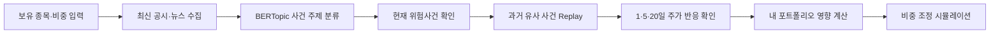
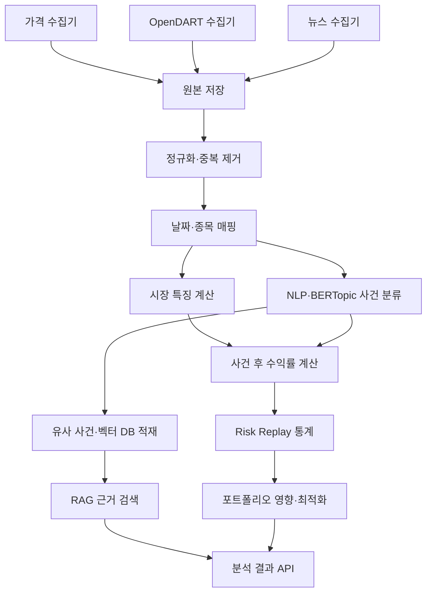

# mini2 상세 기획안

> **프로젝트명**: mini2  
> **프로젝트 유형**: SeSAC 미니 프로젝트 2 — 데이터 기반 지능형 투자  
> **작성 기준일**: 2026-07-18  
> **문서 목적**: 출제 의도를 해석하고, 우리 조가 실제로 무엇을 만들지 쉽게 설명하는 실행 기획안

---

## 0. 먼저 한 문장으로 설명하면

> **공시·뉴스에서 현재 기업의 위험사건을 발견하고, 과거 유사 사건 이후 주가가 실제로 어떻게 움직였는지 재생하여 보여준 뒤, 사용자의 포트폴리오 영향을 계산하는 서비스**

mini2는 주가가 오를 종목을 맞히는 서비스가 아니다. 미래 수익률을 단정하지 않고 다음 질문에 답하는 **사건 기반 투자 위험 의사결정 도구**다. 핵심 기능의 작업명은 **Risk Replay**다.

- 내 포트폴리오에서 어떤 종목의 위험이 커졌는가?
- 현재 어떤 위험사 건이 발생했는가?
- 과거 비슷한 사건 뒤에는 주가가 실제로 어떻게 움직였는가?
- 내 투자 성향을 고려하면 종목 비중을 어떻게 조정할 수 있는가?
- 기존 포트폴리오보다 위험이 실제로 얼마나 줄어드는가?

---

## 1. 2차 미니 프로젝트의 출제 의도

과제 문구를 기술 이름의 나열로 보면 복잡하지만, 실제 출제 의도는 하나의 흐름이다.

> **논문 속 아이디어를 코드로 옮기고, 실제 데이터를 수집하고, 분석 모델과 생성형 AI를 결합하여, 사용자가 판단에 활용할 수 있는 서비스로 완성해 보라.**

### 1.1 과제 문구별 의미

| 과제 문구 | 표면적인 작업 | 실제 평가 의도 |
|---|---|---|
| Vibe Coding | Gemini로 논문 코드를 생성 | 논문의 목적함수·제약조건을 이해하고, 생성 코드를 검증하여 실행 가능한 모델로 옮기는 능력 |
| 데이터 수집 | 공시·뉴스 크롤링/API 연동 | 서로 다른 원천의 정형·비정형 데이터를 날짜와 기업 기준으로 결합하는 능력 |
| ESG·하락 위험 | 키워드와 주가 분석 | 단순 수익률 예측을 넘어 위험 요인을 정의하고 측정하는 문제 설계 능력 |
| Stitch 시각화 | 화면 생성 | 복잡한 모델 결과를 비전공자도 빠르게 이해할 수 있는 정보 구조로 바꾸는 능력 |
| Antigravity 최종물 | 앱 코드 생성 | 분석 노트북을 끝내는 것이 아니라 수집·모델·RAG·UI를 실제 동작하는 제품으로 통합하는 능력 |

### 1.2 교수자가 보고 싶은 결과

1. 논문을 읽고 목적함수와 제약조건을 설명할 수 있다.
2. Gemini가 만든 코드를 그대로 복사하지 않고 결과를 검증한다.
3. 가격 데이터와 공시·뉴스를 하나의 분석 단위로 연결한다.
4. 수업에서 배운 MLP·NLP·LSTM을 문제에 맞게 선택한다.
5. 모델 결과를 사용자 행동으로 연결한다.
6. AI의 답변에 출처와 근거가 있고, 실패 상황도 처리한다.
7. 10분 발표에서 처음부터 끝까지 끊기지 않는 데모를 보여준다.

따라서 이 과제의 정답은 **주식 대시보드**도, **뉴스 요약 챗봇**도, **주가 예측 노트북**도 아니다. 세 가지를 결합해 사용자의 결정을 돕는 **작동하는 의사결정 서비스**가 정답에 가깝다.

---

## 2. 서비스 설계 원칙

mini2는 기술을 각각 시연하는 프로젝트가 아니라, 하나의 사용자 질문을 해결하도록 연결한다.

> **“지금 발생한 사건과 비슷한 일이 과거에 있었을 때 시장은 어떻게 반응했고, 그 일이 내 포트폴리오에는 어떤 영향을 줄 수 있는가?”**

### 2.1 반드시 지킬 구조

- 외부 데이터를 내부 공통 스키마로 정규화하는 구조
- 화면 데이터와 RAG 근거가 같은 원천을 사용하는 구조
- BERTopic으로 공시·뉴스를 위험 주제별로 묶는 구조
- 같은 주제 안에서 과거 유사 사건을 검색하는 구조
- 사건 전후 1일·5일·20일 주가 반응을 계산하는 구조
- 벡터 검색 결과만 LLM 컨텍스트로 제공하는 구조
- Pydantic/JSON 구조화 출력
- LLM 결과를 서버가 다시 검증하는 3계층 방어
- API 장애·검색 결과 없음·시간 초과에 대한 fallback
- 발표용 핵심 사용자 동선을 먼저 완성하는 전략

### 2.2 금융 서비스 원칙

일반적인 콘텐츠 추천과 금융 판단은 위험도가 다르다. 따라서 mini2에서는 다음 원칙을 적용한다.

1. **LLM이 위험점수나 추천 비중을 계산하지 않는다.**
2. 수치는 Python 분석 엔진과 최적화 모델이 계산한다.
3. LLM은 RAG로 찾은 공시·뉴스를 사용해 결과를 설명한다.
4. 모든 근거에 문서명·발행일·링크를 표시한다.
5. `매수`, `매도`, `수익 보장` 대신 `관찰`, `위험 신호`, `비중 조정 시뮬레이션`이라는 표현을 쓴다.
6. 결과 화면에 데이터 기준시각과 모델 한계를 표시한다.

---

## 3. 우리가 만들 제품: mini2 Risk Replay

### 3.1 서비스 정의

mini2는 공시·뉴스에서 기업 사건을 찾고, 과거 유사 사건의 시장 반응과 사용자 포트폴리오 영향을 연결한다. 다음 네 엔진이 함께 분석한다.

1. **사건 탐지 엔진**: 공시·뉴스에서 기업 사건과 호재·악재 방향을 찾는다.
2. **토픽 엔진**: BERTopic으로 개인정보·산업재해·횡령·실적 등 사건 주제를 묶는다.
3. **Replay 엔진**: 같은 주제의 과거 사건 뒤 1일·5일·20일 주가 반응을 계산한다.
4. **포트폴리오 엔진**: 현재 보유 비중에 예상 충격을 적용하고 비중 조정안을 계산한다.

RAG는 세 엔진의 결과를 바꾸지 않고, **왜 그런 결과가 나왔는지 설명할 근거**를 찾는다.

### 3.2 핵심 가치 제안

> 단순히 “위험하다”고 말하지 않고, **과거 비슷한 사건에서 실제로 어떤 결과가 발생했는지**를 문서와 수치로 함께 보여준다.

### 3.3 목표 사용자

| 사용자 | 문제 | mini2의 도움 |
|---|---|---|
| 초보 개인 투자자 | 지표와 공시를 읽기 어렵다 | 위험을 낮음·주의·높음으로 단순화하고 근거를 풀어서 설명 |
| 여러 종목 보유자 | 어느 종목이 전체 위험을 높이는지 모른다 | 종목별 위험 기여도와 조정 우선순위 제시 |
| ESG 관심 투자자 | ESG 뉴스가 실제 보유 종목과 어떻게 연결되는지 모른다 | E·S·G 유형별 이슈와 관련 문서 표시 |

---

## 4. 사용자가 실제로 경험할 흐름

### 4.1 핵심 사용자 여정



### 4.2 데모 시나리오

사용자가 다음 포트폴리오를 입력한다.

```text
투자 성향: 안정형
삼성전자 50%
현대차 30%
NAVER 20%
```

mini2가 다음 순서로 결과를 보여준다.

1. 포트폴리오에서 가장 중요한 최신 위험사건 표시
2. BERTopic이 분류한 사건 주제와 ESG 유형 표시
3. 같은 주제의 과거 유사 사건 수 표시
4. 과거 사건 후 1일·5일·20일 평균 수익률과 하락 비율 표시
5. 실제 근거 공시·뉴스 카드와 원문 링크 표시
6. 현재 보유 비중에 따른 포트폴리오 영향 계산
7. 안정형 기준의 비중 조정 시뮬레이션 제시
8. 사용자가 “과거 비슷한 사건에서는 어땠나요?”라고 질문
9. RAG가 유사 사건 문서만 인용하여 설명

### 4.3 결과 예시

```text
현재 감지 사건: 개인정보·플랫폼 규제 위험
BERTopic 주제: 개인정보 / 보안 / 규제

과거 유사 사건
- 총 24건
- 5일 이내 하락 사례 17건, 71%
- 사건 후 5일 평균 수익률 -4.6%
- 평균 회복 기간 13거래일

내 포트폴리오 영향
- 현재 보유 비중 20%
- 과거 평균 충격이 반복될 경우 단순 추정 영향 -0.9%

비중 조정 시뮬레이션
- 현재 20% → 제안 12%
- 이 변경을 적용하면 예상 포트폴리오 변동성이 감소합니다.

주의: 교육용 분석이며 매수·매도 지시가 아닙니다.
```

---

## 5. 수업 내용 활용 전략

### 5.1 MLP

`01_MLP_Tutorial.ipynb`, `01_vibecoding.ipynb`, `practice.ipynb`을 활용한다.

- 문제 유형: 이진분류
- 입력: 과거 시점까지 계산된 시장·텍스트 특징
- 출력: 향후 5거래일 하락 위험 확률
- 라벨 예시: 향후 5거래일 누적수익률이 `-3% 이하`면 1, 아니면 0
- 전처리: StandardScaler
- 불균형 처리: 우선 class weight, 비교 실험으로 SMOTE
- 평가: Accuracy보다 Recall·Precision·F1·PR-AUC 우선
- 데이터 분할: 랜덤 분할이 아닌 시간순 분할

하락 사례를 놓치지 않는 것이 중요하므로 Recall을 핵심 지표로 삼되, 모든 날을 위험으로 분류하지 않도록 Precision도 함께 본다.

### 5.2 NLP와 TF-IDF

`02_NLP.ipynb`을 활용한다.

- 결측·중복·짧은 문서 제거
- Kiwi 형태소 분석
- 불용어 제거
- TF-IDF로 기업별 중요 위험 키워드 추출
- WordCloud 또는 막대그래프로 위험 키워드 표시
- SentenceTransformer로 유사 공시·뉴스 검색

### 5.3 BERTopic

오늘 배운 BERTopic은 Risk Replay의 핵심 연결 엔진으로 사용한다.

- 공시·뉴스 임베딩 생성
- 의미가 비슷한 문서를 자동 군집화
- c-TF-IDF로 각 군집의 대표 키워드 추출
- 팀원이 군집을 `개인정보·규제`, `산업재해`, `횡령·배임`, `실적 악화`처럼 해석 가능한 이름으로 정리
- 현재 사건을 같은 토픽의 과거 사건과 연결
- 토픽별 사건 후 주가 반응 통계 계산

BERTopic은 호재·악재를 판단하는 모델이 아니므로 사건 방향은 별도의 규칙·분류 모델·구조화 LLM 판정으로 구분한다. 문서가 적은 토픽과 잡음 토픽은 신뢰도를 낮게 표시한다.

### 5.4 RNN·LSTM

`02_reference_code.ipynb`, `03_RNN&LSTM.ipynb`, `03_2_LSTM.ipynb`을 활용한다.

- 토큰화 → 정수 인코딩 → 패딩 → Embedding → LSTM → sigmoid
- 공시·뉴스 문장을 `위험/일반`으로 분류하는 비교 모델
- 금융 라벨이 부족하면 LSTM은 P1 실험으로 두고, P0는 사전+TF-IDF 방식으로 안정화
- 영화 리뷰 감성 모델을 금융 뉴스에 그대로 사용하지 않음

### 5.5 논문 기반 포트폴리오 최적화

Gemini에는 논문 전체를 막연히 “코드로 바꿔줘”라고 하지 않는다. 다음 순서로 사용한다.

1. 목적함수, 입력 변수, 제약조건, 출력 변수를 표로 추출한다.
2. 수식의 각 기호가 코드의 어떤 변수인지 매핑한다.
3. NumPy/SciPy 기반 최소 예제를 생성한다.
4. 동일가중 포트폴리오를 기준선으로 만든다.
5. 가중치 합, 음수 비중, 최대 비중 제한을 단위 테스트한다.
6. 위험점수를 높였을 때 해당 종목 비중이 감소하는지 검증한다.

MVP 목적함수는 해석하기 쉽게 다음처럼 단순화한다.

```text
최소화 = 포트폴리오 분산
       + α × 종목별 하락 위험 확률의 가중합
       + β × 종목별 ESG·텍스트 위험점수의 가중합

제약조건
- 모든 종목 비중의 합 = 1
- 종목 비중은 0 이상
- 한 종목 최대 비중 제한
```

---

## 6. 데이터 전략

### 6.1 MVP 데이터 범위

- 종목: KOSPI 대형주 10개
- 기간: 최근 2년의 일봉 데이터
- 공시: 분석 종목의 최근 1년 OpenDART 공시
- 뉴스: 기업명 검색 결과의 제목·요약·발행일·링크
- 갱신: 발표용 MVP는 수동 새로고침 또는 하루 1회
- 실시간의 의미: 초 단위 시세가 아니라 **요청 시 최신 수집 가능 여부와 기준시각 표시**

### 6.2 데이터 출처

| 데이터 | P0 권장 소스 | 비고 |
|---|---|---|
| 기업·공시 | OpenDART API | 기업 고유번호, 공시 목록, 원문/주요 정보 수집 |
| 뉴스 | NAVER API HUB 검색 API | 제목·요약·발행일·링크 중심, 중복 제거 |
| 주가 | 팀이 사전 검증한 일봉 공급자 어댑터 | MVP에서는 일봉만 사용하고 로컬 CSV fallback 필수 |
| 논문 | 수업에서 지정·선정한 최적화/리스크 논문 | 수식과 제약조건의 원본 근거 |

2026년 7월 기준 기존 NAVER Developers 검색 API가 NAVER API HUB로 이전 중이므로 신규 키는 API HUB 기준으로 준비한다.

### 6.3 공통 스키마

```text
Company
- company_id, corp_code, stock_code, company_name, sector

MarketDaily
- stock_code, trading_date, open, high, low, close, volume

CompanyDocument
- document_id, stock_code, source_type, title, summary
- published_at, url, esg_category, event_direction, topic_id, risk_keywords, content_hash

RiskEvent
- event_id, stock_code, event_date, topic_id, direction
- document_ids, return_1d, return_5d, return_20d, recovery_days

DailyFeature
- stock_code, feature_date
- return_1d, return_5d, volatility_20d, volume_ratio_20d
- drawdown_20d, news_count_7d, text_risk_7d, esg_e, esg_s, esg_g
- downside_label_5d
```

### 6.4 수집 파이프라인



### 6.5 데이터 누출 방지

- 특정 날짜의 예측에는 그 날짜 이전에 공개된 문서만 사용한다.
- 향후 5일 수익률은 라벨 생성에만 사용한다.
- 학습·검증·테스트를 시간순으로 분리한다.
- 분할 경계에는 5거래일 간격을 둔다.
- StandardScaler와 SMOTE는 학습 데이터에만 적용한다.

---

## 7. 위험점수와 의사결정 구조

### 7.1 종목 위험점수

```text
총 위험점수 = 45% × MLP 하락 위험
             + 25% × 시장 위험
             + 30% × 텍스트·ESG 위험
```

초기 가중치는 MVP용 가설이며 검증 결과에 따라 조정한다. `위험점수`와 `하락 확률`은 같은 값이 아니므로 화면에서 별도로 표시한다.

| 위험점수 | 상태 | UI |
|---:|---|---|
| 0~39 | 낮음 | 초록 |
| 40~69 | 주의 | 노랑 |
| 70~100 | 높음 | 빨강 |

### 7.2 투자 성향 반영

| 성향 | 최적화 방향 |
|---|---|
| 안정형 | 변동성·하락 위험 패널티를 크게, 한 종목 최대 비중을 낮게 |
| 균형형 | 위험과 기존 비중 변화 사이 균형 |
| 적극형 | 위험 패널티를 낮추되 과도한 집중은 제한 |

### 7.3 신뢰도 표시

위험도와 별개로 데이터 신뢰도를 표시한다.

- 높음: 가격·공시·뉴스가 모두 최신이며 모델 입력이 충분함
- 보통: 뉴스 또는 공시가 부족함
- 낮음: 데이터가 오래됐거나 분석 표본이 부족함

신뢰도가 낮으면 강한 비중 조정 문구를 만들지 않는다.

---

## 8. RAG 설계

### 8.1 RAG가 하는 일과 하지 않는 일

| 하는 일 | 하지 않는 일 |
|---|---|
| 현재 사건의 실제 공시·뉴스 검색 | 주가 예측값 생성 |
| 같은 BERTopic 주제의 과거 유사 사건 검색 | 포트폴리오 비중 계산 |
| 검색된 문서를 근거로 쉬운 설명 생성 | 근거 없이 매수·매도 단정 |
| 문서명·날짜·링크 반환 | 존재하지 않는 공시·뉴스 생성 |

### 8.2 검색 방식

1. `topic_id`, `event_direction`, `published_at`, `source_type`으로 메타데이터 필터
2. 현재 사건과 과거 문서를 벡터 유사도로 검색
3. TF-IDF 키워드 일치와 사건 유형 일치로 재정렬
4. 상위 근거 3~5개만 LLM에 제공
5. 답변의 모든 핵심 주장에 source ID 연결

### 8.3 금융용 4계층 안전장치

1. 프롬프트: 제공된 근거 밖의 사실 금지
2. 구조화 출력: JSON 스키마 강제
3. 사후 검증: source ID·기업·날짜·링크 대조
4. 수치 잠금: 위험점수와 비중은 서버 계산값을 그대로 사용

LLM 실패 시에도 모델 결과는 보여주며, 설명은 “상위 위험 키워드와 관련 문서 목록”을 조합한 규칙 기반 문장으로 대체한다.

---

## 9. Stitch 화면 기획

Google Stitch는 자연어 또는 와이어프레임으로 UI 시안을 만들고 프런트엔드 코드/Figma 흐름으로 넘기는 도구로 사용한다. 분석 엔진 역할을 맡기지 않는다.

### 9.1 필요한 화면

| 화면 | 핵심 내용 | 우선순위 |
|---|---|:---:|
| 포트폴리오 입력 | 종목 검색, 비중 입력, 투자 성향 선택 | P0 |
| 사건 대시보드 | 현재 위험사건, BERTopic 주제, 데이터 기준시각 | P0 |
| Risk Replay | 유사 사건 수, 1·5·20일 수익률, 하락 비율, 회복 기간 | P0 |
| 종목 상세 | 현재 사건, E/S/G 유형, 키워드, 근거 문서 | P0 |
| 리밸런싱 비교 | 기존/제안 비중, 변동성·MDD 비교 | P0 |
| 근거 기반 AI 질의 | 질문, 답변, 출처 카드 | P0 |
| 모델 실험실 | MLP/LSTM 성능, 혼동행렬, 오류 사례 | P1 |
| 포트폴리오 도미노 | 같은 위험 토픽에 노출된 보유 종목 연결 지도 | P1 후보 |
| 기회 Replay | 호재 사건의 과거 상승·지속성 분석 | P1 후보 |

### 9.2 첫 화면에서 반드시 보여야 하는 것

- 현재 포트폴리오 종합 상태
- 가장 위험한 종목 1개
- 위험 원인 3개
- 추천 조정의 핵심 한 줄
- 데이터 기준시각
- 교육용 분석 고지

화면은 차트가 많아 보이는 것보다 “그래서 무엇을 확인해야 하는가?”가 5초 안에 보이는 것이 중요하다.

---

## 10. Antigravity 활용 방식

Antigravity는 투자 판단 엔진 자체가 아니라 **제품 구현과 통합을 돕는 agent-first 개발 환경**으로 사용한다.

### 10.1 맡길 작업

- 데이터 수집기와 정규화 코드 생성
- 분석 엔진 API 연결
- Stitch 산출물을 실제 화면 컴포넌트로 전환
- 테스트 생성 및 브라우저 기반 사용자 흐름 검증
- 오류 로그 확인과 반복 수정
- README·환경변수 예시·실행 스크립트 정리

### 10.2 사람이 직접 검토할 작업

- 논문 수식 해석
- 라벨과 위험 기준 정의
- 데이터 누출 여부
- 모델 평가와 최종 가중치
- 투자 문구와 면책 고지
- 출처가 실제 주장과 일치하는지 여부

---

## 11. MVP 범위

### 11.1 반드시 구현하는 것(P0)

- 10개 종목 중 3~5개를 선택해 비중 입력
- 안정형·균형형·적극형 선택
- 가격·OpenDART·뉴스 수집 및 정규화
- 시장 위험지표 계산
- TF-IDF·ESG 사전 기반 텍스트 위험점수
- BERTopic 기반 사건 주제 군집화
- 현재 사건과 같은 토픽의 과거 유사 사건 검색
- 사건 후 1일·5일·20일 주가 반응과 하락 비율 계산
- 현재 보유 비중에 따른 포트폴리오 영향 계산
- MLP 하락 위험 모델 또는 저장된 학습 결과 연동
- 위험 반영 포트폴리오 최적화
- 기존/제안 비중 및 위험 비교
- RAG 근거 검색과 출처 표시
- API/LLM 실패 fallback
- Stitch 기반 반응형 주요 화면

### 11.2 시간이 남으면(P1)

- LSTM 위험 문장 분류 비교 실험
- 과거 유사 사건 검색
- 사용자 후속 질문
- 분석 결과 PDF/이미지 저장
- 일일 자동 수집 스케줄러
- **기회 Replay**: 대규모 수주·실적 개선·자사주 매입 등 호재의 과거 반응 분석
- **포트폴리오 도미노**: 여러 보유 종목이 같은 BERTopic 위험 주제에 노출됐는지 연결 지도 표시

### 11.3 하지 않는 것(Non-Goals)

- 초 단위 실시간 시세
- 전 종목 지원
- 자동 주문·증권계좌 연동
- 실제 매수·매도 신호
- 수익 보장 또는 목표가 제시
- 고빈도 트레이딩
- 복잡한 인증·결제·커뮤니티
- 처음부터 뉴스 본문 전체를 무제한 크롤링

---

## 12. 팀 진행 방식

### 12.1 4명 역할 예시

| 역할 | 담당 |
|---|---|
| 데이터 | 가격·OpenDART·뉴스 수집, 정규화, 저장, fallback 데이터 |
| ML/NLP | 특징 생성, MLP, TF-IDF, ESG 사전, LSTM 실험, 평가 |
| AI/백엔드 | FastAPI, 벡터 DB, RAG, 구조화 출력, 사후검증, 최적화 API |
| 프런트/제품 | Stitch, 화면 구현, 차트, E2E 연결, 발표 시나리오 |

3명이라면 데이터와 ML을 합치고, 5명이라면 백테스트·QA를 별도 담당으로 둔다.

### 12.2 권장 개발 순서

| 단계 | 목표 | 완료 기준 |
|---|---|---|
| 1. 문제 고정 | 종목·기간·라벨·사용자 결정 | 한 페이지 기획 합의 |
| 2. 데이터 세로 자르기 | 종목 1개 전체 파이프라인 | 가격+공시+뉴스가 날짜로 결합됨 |
| 3. 기준선 | 단순 위험지표와 동일가중 비교 | UI에 실제 수치 표시 |
| 4. 모델 | MLP·텍스트 위험·최적화 | 테스트 데이터 평가 완료 |
| 5. RAG | 근거 검색과 출처 검증 | 없는 문서를 말하지 않음 |
| 6. UI 통합 | 입력부터 결과까지 연결 | 핵심 데모 E2E 통과 |
| 7. 안정화 | fallback·속도·발표 준비 | 네트워크 실패 상태에서도 데모 가능 |

처음부터 10개 종목 전체를 수집하지 말고 **종목 1개로 전체 흐름을 먼저 완성**한 뒤 범위를 넓힌다.

---

## 13. 성공 기준

### 13.1 제품 성공 기준

- 사용자가 3분 안에 포트폴리오를 입력하고 가장 위험한 종목을 이해한다.
- 모든 RAG 답변에 실제 출처가 표시된다.
- 기존 비중과 제안 비중의 차이를 한 화면에서 이해할 수 있다.
- 데이터 기준시각과 신뢰도를 확인할 수 있다.
- 외부 API 또는 LLM이 실패해도 저장된 데이터로 핵심 데모가 작동한다.

### 13.2 모델 성공 기준

- MLP를 단순 기준선과 비교한다.
- 시간순 테스트셋에서 Recall·Precision·F1·PR-AUC를 기록한다.
- 최적화 결과의 비중 합이 1이다.
- 종목별 비중 제한을 지킨다.
- 위험 패널티를 높이면 고위험 종목 비중이 감소한다.
- 투자 성향별 제안 결과가 실제로 달라진다.

### 13.3 발표 성공 기준

발표자가 다음 문장을 명확히 말할 수 있어야 한다.

> “저희는 주가를 맞히는 서비스를 만들지 않았습니다. 수치 모델로 포트폴리오 위험을 계산하고, 공시·뉴스 RAG로 그 위험의 근거를 검증하며, 투자 성향에 따라 비중 조정 시뮬레이션을 제공하는 mini2를 만들었습니다.”

---

## 14. 주요 리스크와 대응

| 리스크 | 영향 | 대응 |
|---|---|---|
| 공시·뉴스 데이터 부족 | 텍스트 점수 왜곡 | 데이터 신뢰도 하향, 강한 판단 금지 |
| 뉴스 API 정책·키 문제 | 데모 중 수집 실패 | 미리 저장한 snapshot과 로컬 JSON fallback |
| MLP 성능 부족 | 하락 확률 신뢰성 저하 | 단순 기준선과 비교하고 모델을 보조지표로 제한 |
| 클래스 불균형 | 모두 정상으로 예측 | class weight 우선, SMOTE는 학습 데이터에서만 실험 |
| LLM 할루시네이션 | 잘못된 투자 근거 | source ID 검증, 수치 잠금, 근거 없는 문장 제거 |
| 실시간 범위 과대 | 구현 지연 | 일봉·요청 시 갱신으로 MVP 정의 |
| 화면 과밀 | 사용자가 결론을 못 찾음 | 종합 상태→원인→근거→행동 순서 유지 |
| 금융 조언 오해 | 법적·윤리적 위험 | 교육용·시뮬레이션 고지, 매수·매도 단정 금지 |

---

## 15. 공식 참고자료

- [OpenDART 개발가이드](https://opendart.fss.or.kr/guide/main.do)
- [OpenDART 공시검색 API](https://opendart.fss.or.kr/guide/detail.do?apiGrpCd=DS001&apiId=2019001)
- [Google Stitch 공식 소개](https://developers.googleblog.com/en/stitch-a-new-way-to-design-uis/)
- [Google Antigravity 공식 소개](https://blog.google/innovation-and-ai/technology/developers-tools/gemini-3-developers/)
- [Google Antigravity 2.0 및 I/O 2026 개발자 발표](https://blog.google/innovation-and-ai/technology/developers-tools/google-io-2026-developer-highlights/)
- [NAVER 검색 API의 NAVER API HUB 이관 공지](https://developers.naver.com/notice/article/32530)

---

## 16. 최종 결론

우리 조가 만들 것은 **“AI 주식 추천 챗봇”이 아니다.**

> **mini2는 현재 기업의 위험사건을 감지하고, 과거 비슷한 사건에서 주가가 실제로 어떻게 반응했는지 Risk Replay로 보여준 뒤, 그 위험이 사용자의 포트폴리오에 미칠 영향과 비중 조정안을 제시하는 데이터 기반 투자 의사결정 플랫폼이다.**

이번 수업의 `크롤링/API → NLP/TF-IDF → BERTopic → 임베딩/RAG → MLP/LSTM → 포트폴리오 최적화`를 하나의 사건 분석 흐름으로 연결한다. P0는 Risk Replay에 집중하고, 호재를 다루는 기회 Replay와 공통 위험 노출을 보여주는 포트폴리오 도미노는 팀 선택에 따라 P1으로 확장한다.
